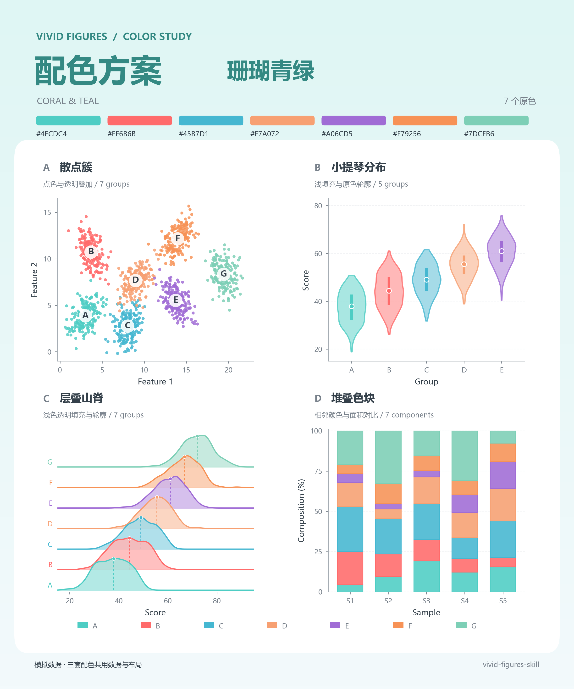
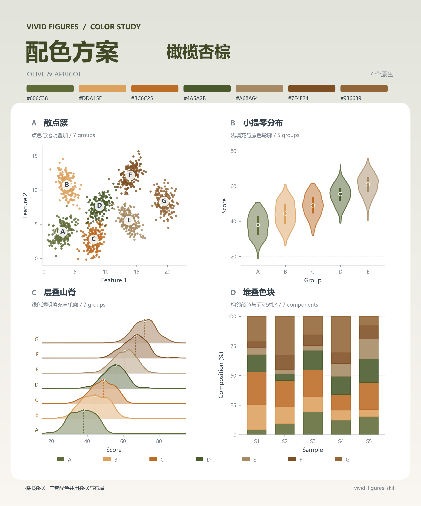
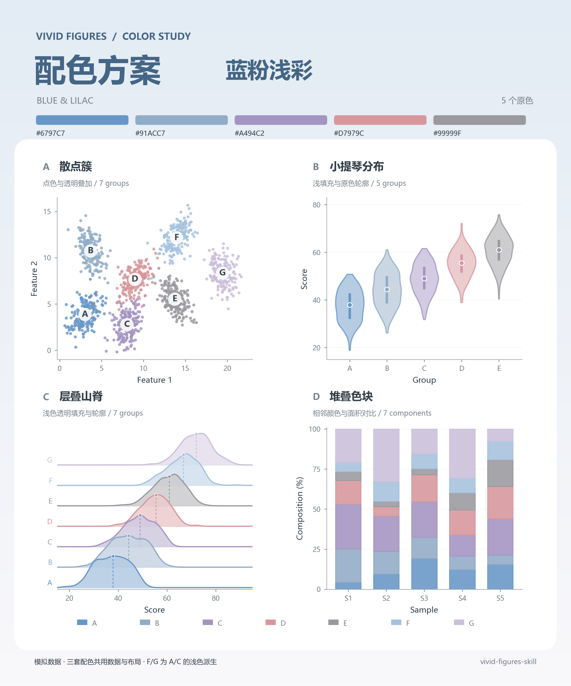
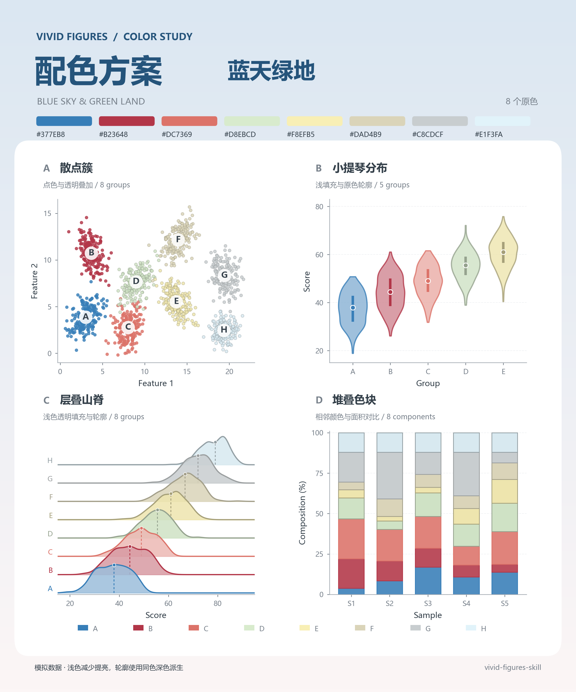
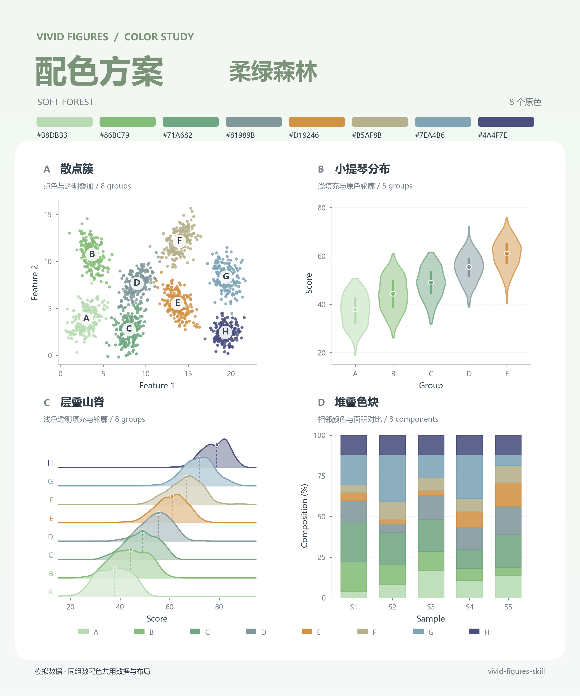
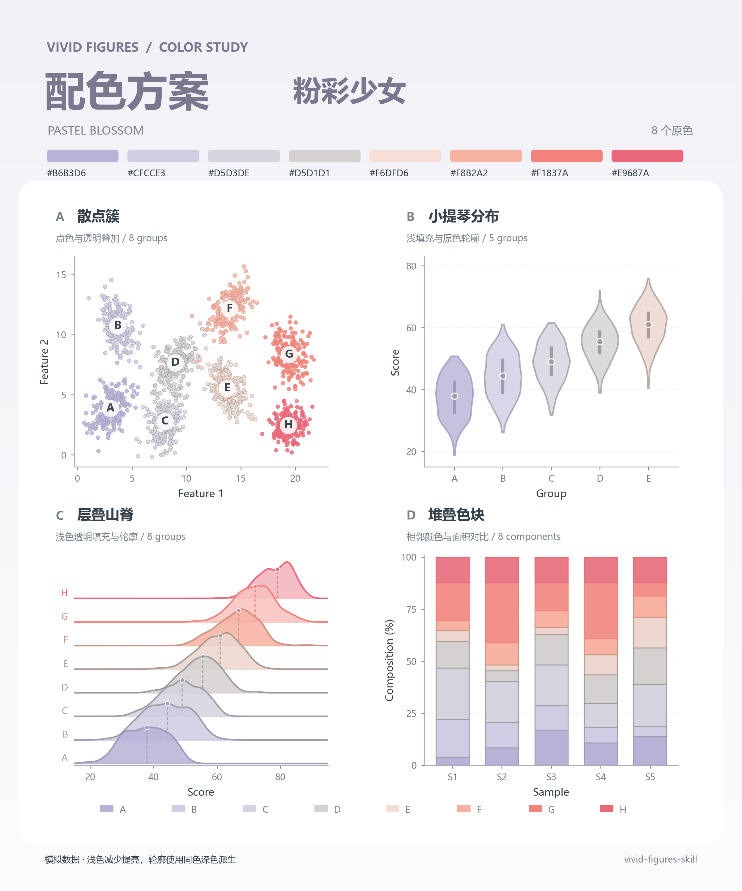
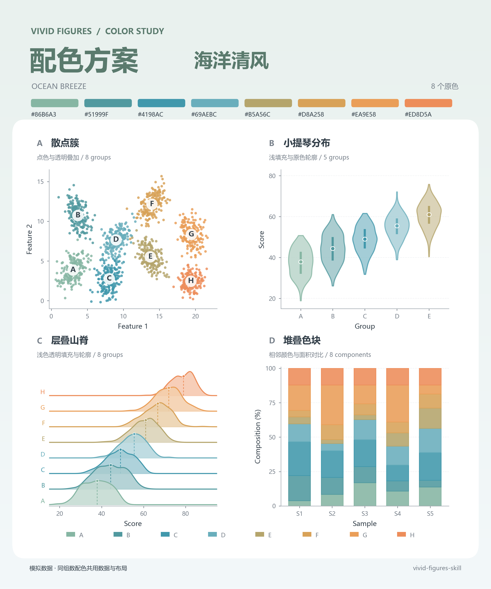

# Vivid Figures · 生动数据图

**把数据交给 AI，让它帮你选图、画图、检查，再交付图片和绘图源码**。

这是一个给 AI 助手使用的科研绘图 Skill，适合论文、数学建模和实验报告。内含 **140 个图表配方**，统一使用有层次的绘图指导，提供 **七套配色和自定义颜色**，可以生成 PNG、PDF，以及可继续修改的绘图代码。

[安装指南](docs/INSTALL.md) · [怎么用](docs/USAGE.md) · [配色与源码](examples/palette-posters/README.md) · [更新记录](CHANGELOG.md)

> **仅限个人、非商业使用；未经书面许可，禁止二次开发及商业使用**。完整限制见 [LICENSE](LICENSE)。

## 开放格式，按需加载

采用 [Agent Skills 开放规范](https://agentskills.io/specification)：根目录 `SKILL.md` 使用标准 YAML 元数据和 Markdown 正文，其他文件按相对路径加载。可交给支持该规范、具备文件读写、代码执行与图像查看能力的助手使用；安装位置及调用方式由具体客户端决定。

采用开放 Agent Skills 格式。绘图指导统一维护，配色由单一 JSON 色板提供，项目配置使用 `.vivid/`。使用许可见 [LICENSE](LICENSE)。

## 你可以让它做什么

| 你手上的材料 | 可以让 AI 做的事 |
|---|---|
| Excel、CSV、JSON 数据 | 读懂字段，选择合适的图型，再生成图表 |
| 实验结果、模型对比 | 画性能对比、误差分布、收敛曲线、置信区间等 |
| 空间坐标、曲面或工程数据 | 按数据需要画三维曲面、轨迹、地图或工程图 |
| 方法说明、步骤和关系 | 画流程图、技术路线图、精确几何图 |
| 已有图和绘图源码 | 调整颜色、文字、间距或布局，尽量保留原模板的设计 |

你不需要先知道图表叫什么。可以直接说：“比较这几种方法的结果，选能看清差异的图。”AI 会根据数据选择；你也可以指定山脊图、雨云图、热力图等具体图型。

选图时，AI 先理解数据和表达目的，再查说明卡、查看候选实图，最后读取完整配方。内置 [141 张模板说明卡与预览](catalog/index.html)，覆盖 108 个原配方、32 个新增截图恢复模板及 1 个完整组合模板；全部模板统一检索，可按用途、结构和数据要求搜索、按标签筛选。下载后可在浏览器打开图文目录。

## 七套配色

点击图片查看高清示意。每张包含散点簇、小提琴分布、层叠山脊与堆叠色块，展示浅填充、轮廓和透明叠加效果。全部为模拟数据，展示图是配方适配示例；实际绘图仍读取当前完整配方和保真要点。

| 珊瑚青绿 · 7色 | 橄榄杏棕 · 7色 | 蓝粉浅彩 · 5色 |
|:---:|:---:|:---:|
| [](docs/images/palettes/coral-teal.png) | [](docs/images/palettes/olive-apricot.png) | [](docs/images/palettes/blue-pink.png) |

| 蓝天绿地 · 8色 | 柔绿森林 · 8色 |
|:---:|:---:|
| [](docs/images/palettes/blue-sky.png) | [](docs/images/palettes/soft-forest.png) |

| 粉彩少女 · 8色 | 海洋清风 · 8色 |
|:---:|:---:|
| [](docs/images/palettes/pastel-girl.png) | [](docs/images/palettes/ocean-breeze.png) |

[完整色值](original/resources/assets/shared-scripts/palettes.json) · [高清 PNG / SVG / PDF 与生成源码](examples/palette-posters/README.md)

默认橄榄杏棕，也支持自定义颜色。蓝粉浅彩海报的 F/G 为原色的浅色派生；蓝天绿地、粉彩少女海报对过浅图元减少提亮并加深同色轮廓，保留透明度。新增四套色板中过浅的原色已适度调深，保留原有色系；本轮未修改模板提白、透明度或绘图流程。原三张采用七组数据，新四张采用八组数据，各组数内共用数据和布局。

绘图沿用统一的选图、构图与检查指导，只需选择配色。没有选定配色时使用橄榄杏棕；同一任务的补图和修图会沿用已有选择。也可以直接说“用默认”或“你来决定”。

## 安装后，直接这样说

在助手中加载整个 Skill 文件夹后，直接说明要使用 `vivid-figures-skill`：

```text
用 vivid-figures-skill 读取 results.csv，比较不同方法的得分分布。
用珊瑚青绿配色。图型你来选，输出 PNG、PDF 和绘图源码。
```

```text
用 vivid-figures-skill 给这份实验结果画一组论文配图。
用珊瑚青绿配色。保留模板的渐变和层次，不要随意简化。
```

```text
继续修改刚才的图：图例移到上方，字号稍微加大。
沿用已经选好的风格和配色，保留其他设计。
```

AI 会读取数据、选择配方、执行绘图、查看生成结果并按需修复。通常在你的任务目录下生成 `figures/`；PNG 方便预览，PDF 方便排版，源码用于复现和继续修改。[更多用法](docs/USAGE.md)。

## 电脑需要准备什么

需要一个**能读写文件、运行 Python、查看图片的 AI 助手**。支持 Agent Skills 的工具可按各自的导入或搜索目录机制加载整个文件夹；通用宿主接口见 [host-adapter.md](host-adapter.md)。

- **基础环境**：Python 3.10+ 和本仓库的 Python 依赖。
- **安装与检查**：使用克隆命令需要 Git；运行随附的 Bash 检查脚本需要 Bash。Windows 可使用 Git for Windows 自带的 Git Bash。
- **完整图集规划**：建议安装 Node.js 22.6+。
- **可选能力**：流程图、LaTeX 技术图、HTML、Mermaid 或 AI 场景插图，各自需要对应工具；普通数据图不必把这些全部装上。

**第一次使用，请按 [安装指南](docs/INSTALL.md) 完成 Skill 和 Python 依赖安装**。里面分别提供 Windows、macOS/Linux 命令，以及可选工具说明。普通数据图不需要额外配置图像生成 API Key；AI 助手自身的账户或模型连接仍需可用。

## 模板会被 AI 简化吗

Skill 明确要求先读取完整配方，以配方代码为起点适配数据。模板的渐变、透明度层次和关键图形元素应保留，不能为了省代码而随意改成纯色或只留轮廓。修图优先调整位置、间距和尺寸。

现在每张说明卡还列出带源码行号的保留重点和允许适配范围，绘制前先看，再在完整代码底稿内修改。可选的源码差异工具能提示色带、轮廓等变化；最终仍对照实图判断，不靠“脚本没报错”认定保真。见 [源码底稿与保真要点](template-fidelity.md)。

这些是给模型的执行要求，实际效果仍取决于模型是否遵循指导；示例不是每次出图效果的保证。数据不支持某种元素时，AI 应说明调整原因。例如，没有重复试验或区间数据，就不能凭空补一条置信带。

## 最近更新

**2026-09-15 · 模板与配色更新**：按截图顺序接入32种设计，总计141张说明卡、143张预览。包括三维场、环形图、组合热图、河流图和极坐标图；来源缺页、缺数据及按图重建情况在各模板说明中标注。目录统一检索，七套配色分别维护分类取色顺序与连续色阶；原色值和模板透明度保持不变。

[下载当前 skill 安装包及粉彩少女全模板图集](https://github.com/yjz211/vivid-figures-skill/releases/tag/v2026.09.15)：图集包含143张高清单图和16张3×3九宫格。部分热图的配色视觉效果后续继续微调。

**2026-09-15**：入口与宿主适配统一为开放 Agent Skills 格式；上线七套配色及高清示意，修正过浅图元的辨识度；随包提供109张模板卡、111张预览、完整源码底稿与可选保真差异提示。格式转换没有修改绘画流程、原始绘图提示词或配方。

[完整更新记录](CHANGELOG.md) · [仓库文件说明](docs/USAGE.md#仓库里的文件分别做什么)

## 使用限制

仅限个人、非商业使用。未经版权所有者事先书面许可，禁止修改、改编、二次开发、制作衍生作品、再分发、转售、提供付费服务或用于其他商业用途。第三方组件及材料仍遵循各自的许可证和声明。完整条款见 [LICENSE](LICENSE)。
