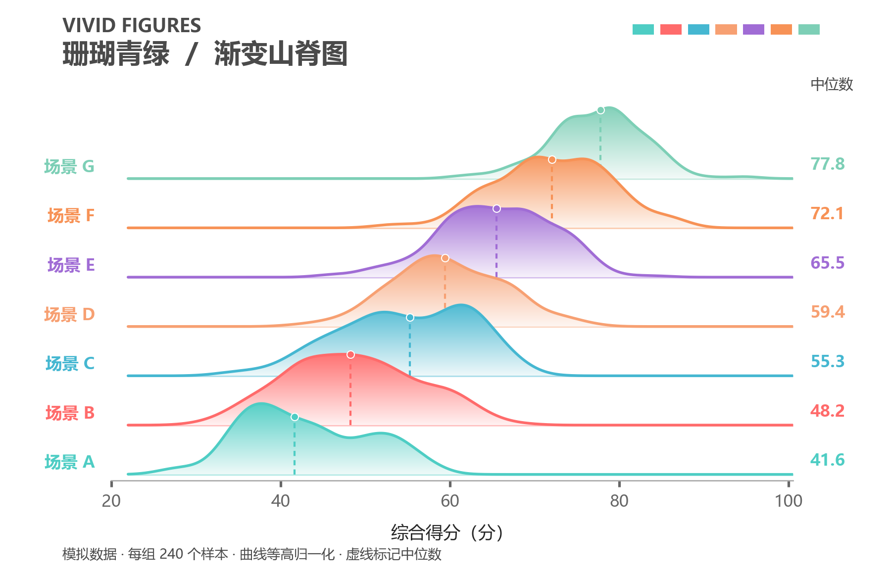
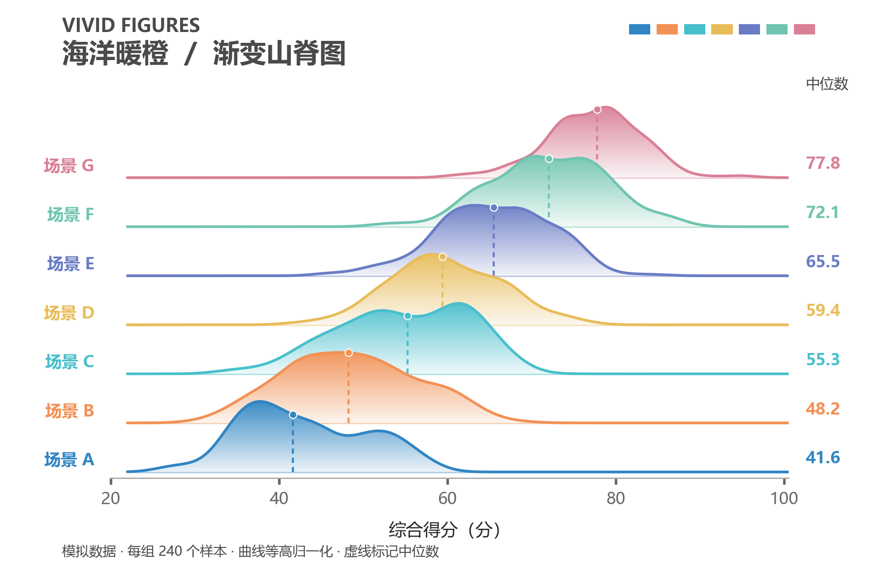
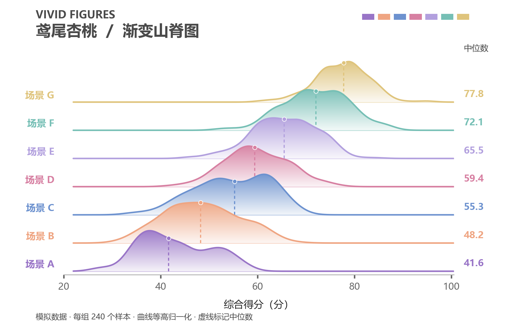
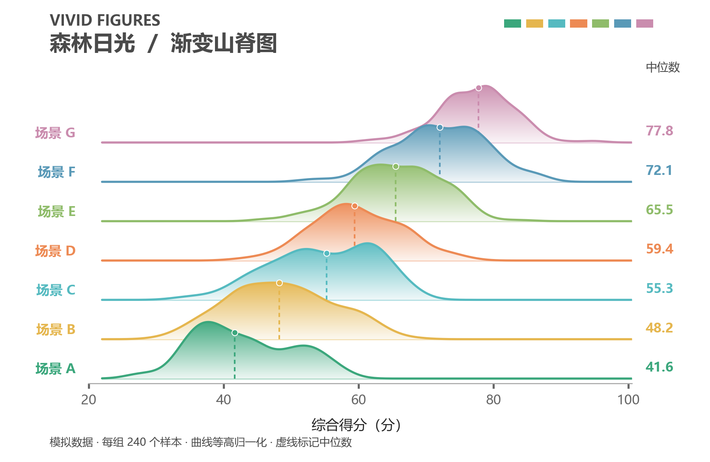
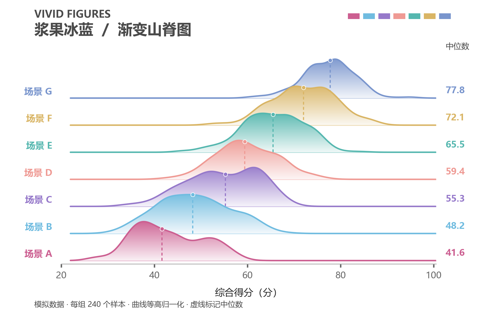

# Vivid Figures · 生动数据图

**把数据交给 AI，让它帮你选图、画图、检查，再交付图片和绘图源码。**

这是一个给 AI 助手使用的科研绘图 Skill，适合论文、数学建模和实验报告。内含 **108 个图表配方**，支持 **鲜艳 / 稳重两种风格**，可以生成 PNG、PDF，以及可继续修改的绘图代码。

[安装指南](docs/INSTALL.md) · [怎么用](docs/USAGE.md) · [更新记录](CHANGELOG.md)

> **仅限个人、非商业使用；未经书面许可，禁止二次开发及商业使用。**完整限制见 [LICENSE](LICENSE)。



*上图由本 Skill 的山脊图配方适配生成。渐变填充、层叠曲线和中位数标记均由 Python 绘制；数据为模拟样本，仅用于展示效果。*

## 你可以让它做什么

| 你手上的材料 | 可以让 AI 做的事 |
|---|---|
| Excel、CSV、JSON 数据 | 读懂字段，选择合适的图型，再生成图表 |
| 实验结果、模型对比 | 画性能对比、误差分布、收敛曲线、置信区间等 |
| 空间坐标、曲面或工程数据 | 按数据需要画三维曲面、轨迹、地图或工程图 |
| 方法说明、步骤和关系 | 画流程图、技术路线图、精确几何图 |
| 已有图和绘图源码 | 调整颜色、文字、间距或布局，尽量保留原模板的设计 |

你不需要先知道图表叫什么。可以直接说：“比较这几种方法的结果，选能看清差异的图。”AI 会根据数据选择；你也可以指定山脊图、雨云图、热力图等具体图型。

## 同一张图，五种配色

下面四张与页首使用**同一份数据、同一图型、同一布局**，只换颜色。点击图片可看大图。

| 海洋暖橙 · 清爽鲜明 | 鸢尾杏桃 · 柔和细腻 |
|---|---|
| [](docs/images/ocean.png) | [](docs/images/iris.png) |
| **森林日光 · 自然明亮** | **浆果冰蓝 · 活泼通透** |
| [](docs/images/forest.png) | [](docs/images/berry.png) |

五套配色都能用于鲜艳版和稳重版。此外还有科研原配色，也可以提供自己的颜色。切换配色时，模板的渐变、浅填充、描边和透明层次仍按原指导保留。

示例包含七组数据，每组 240 个模拟样本。曲线高度做了归一化，用于比较分布形状与位置，不能把峰高当作样本数量。[查看示例数据和生成方法](examples/palette-showcase/README.md)。

## 鲜艳版和稳重版怎么选

| | 鲜艳版 | 稳重版 |
|---|---|---|
| 设计取向 | 明亮、有层次，主动考虑更丰富的信息表达 | 直接、规整，优先清楚地表达结论 |
| 选图倾向 | 适合时考虑融合图、组合图或新颖单图 | 优先常见易读的图型，必要时使用组合图 |
| 原配色 | 珊瑚青绿 | 科研原配色 |
| 能否换色 | 可以，全部配色可选 | 可以，全部配色可选 |

**风格和配色是两件事。**你可以用“稳重版 + 浆果冰蓝”，也可以用“鲜艳版 + 科研原配色”。两种模式都支持三维图，也都使用同一套配方与检查工具。

没有指定时，AI 会先问你用哪种风格、哪套颜色。选定之后，同一任务的补图和修图会沿用，不逐张重复询问。你也可以直接说“用默认”或“你来决定”。

## 安装后，直接这样说

在 Claude Code 中，可以用 `/vivid-figures-skill` 调用，也可以直接说明要用这个 Skill：

```text
用 vivid-figures-skill 读取 results.csv，比较不同方法的得分分布。
用鲜艳版、海洋暖橙配色。图型你来选，输出 PNG、PDF 和绘图源码。
```

```text
用 vivid-figures-skill 给这份实验结果画一组论文配图。
用稳重版、鸢尾杏桃配色。保留模板的渐变和层次，不要随意简化。
```

```text
继续修改刚才的图：图例移到上方，字号稍微加大。
沿用已经选好的风格和配色，保留其他设计。
```

AI 会读取数据、选择配方、执行绘图、查看生成结果并按需修复。通常在你的任务目录下生成 `figures/`；PNG 方便预览，PDF 方便排版，源码用于复现和继续修改。[更多用法](docs/USAGE.md)。

## 电脑需要准备什么

需要一个**能读写文件、运行 Python、查看图片的 AI 助手**。安装指南以 Claude Code 为例；其他支持 Agent Skills 的工具，需按各自方式加载整个 Skill 文件夹。

- **基础环境：**Python 3.10+ 和本仓库的 Python 依赖。
- **安装与检查：**使用克隆命令需要 Git；运行随附的 Bash 检查脚本需要 Bash。Windows 可使用 Git for Windows 自带的 Git Bash。
- **完整图集规划：**建议安装 Node.js 22.6+。
- **可选能力：**流程图、LaTeX 技术图、HTML、Mermaid 或 AI 场景插图，各自需要对应工具；普通数据图不必把这些全部装上。

**第一次使用，请按 [安装指南](docs/INSTALL.md) 完成 Skill 和 Python 依赖安装。**里面分别提供 Windows、macOS/Linux 命令，以及可选工具说明。普通数据图无需安装 HaJiMi 应用，也不需要额外配置 OpenAI API Key；AI 助手自身的账户或模型连接仍需可用。

## 模板会被 AI 简化吗

Skill 明确要求先读取完整配方，以配方代码为起点适配数据。模板的渐变、透明度层次和关键图形元素应保留，不能为了省代码而随意改成纯色或只留轮廓。修图优先调整位置、间距和尺寸。

这些是给模型的执行要求，实际效果仍取决于模型是否遵循指导；示例不是每次出图效果的保证。数据不支持某种元素时，AI 应说明调整原因。例如，没有重复试验或区间数据，就不能凭空补一条置信带。

## 最近更新

**2026-09-13：**鲜艳版、稳重版均支持新增的四套配色；使用前询问配色。新增五套同数据山脊图示例，重写首页、安装和使用说明。本次展示与文档更新没有修改原始绘图提示词、108 个配方或运行代码。

[完整更新记录](CHANGELOG.md) · [仓库文件说明](docs/USAGE.md#仓库里的文件分别做什么)

## 使用限制

仅限个人、非商业使用。未经版权所有者事先书面许可，禁止修改、改编、二次开发、制作衍生作品、再分发、转售、提供付费服务或用于其他商业用途。第三方组件及材料仍遵循各自的许可证和声明。完整条款见 [LICENSE](LICENSE)。
