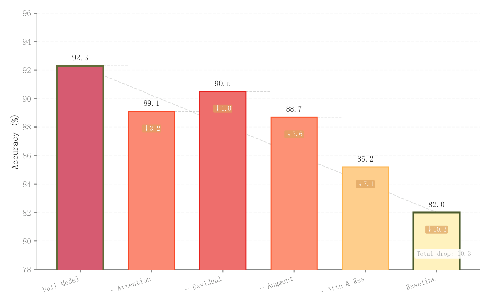

# 068 · 消融配置柱状比较

ID：`academic.ablation`

用途：移除组件对模型表现有何影响？

标签：比较、解释

别名：消融配置柱状比较

## 数据要求

- 配置名称
- 表现值
- 与完整模型的差异

## 组合结构

单面板柱；配置间连接标记

## 视觉特点

- 黄红数值配色
- 差值箭头
- 首尾柱强调

## 适配注意

当前颜色注释与实际YlOrRd不一致；每根柱均匀填充；示例截断纵轴会放大差距。

## 预览

## 来源与核对

原名称：Ablation Study Bar Chart — 消融实验柱状图
原始代码：[查看](../sources/academic.ablation/original.html)
预览范围：首个主要Python示例
已查看对应预览并核对主要绘图和数据代码；卡片不是统计有效性认证。

预览执行兼容调整：RGB/RGBA 元组转十六进制以适配原 _lighten 接口，颜色含义不变

## 相近候选

- [累计增益阶梯与贡献色带](advanced.waterfall.md)
- [增减贡献浮动柱瀑布](competition.waterfall.md)
- [相对基线发散条形](advanced.diverging_bar.md)

<!-- fidelity:start -->
## 源码保真要点

以当前完整配方源码为底稿；下列行号指向解释预览的快照。数据适配不应顺手删掉这些视觉结构。

### 浅柱、连接和增益标记

- 保留重点：保留随得分变化的浅填色与深边、首尾强调及增益连接标记。
- 可适配：配置顺序、得分、增益方向和范围按实验更新；对无逐步关系的配置不伪造累积链条。
- 源码：[L18–19](../sources/academic.ablation/original.html#L18) · [L23–24](../sources/academic.ablation/original.html#L23) · [L32–36](../sources/academic.ablation/original.html#L32) · [L52–53](../sources/academic.ablation/original.html#L52)

按现有审图流程对照实际输出；有疑问时可用[源码差异提示](../../template-fidelity.md)。
