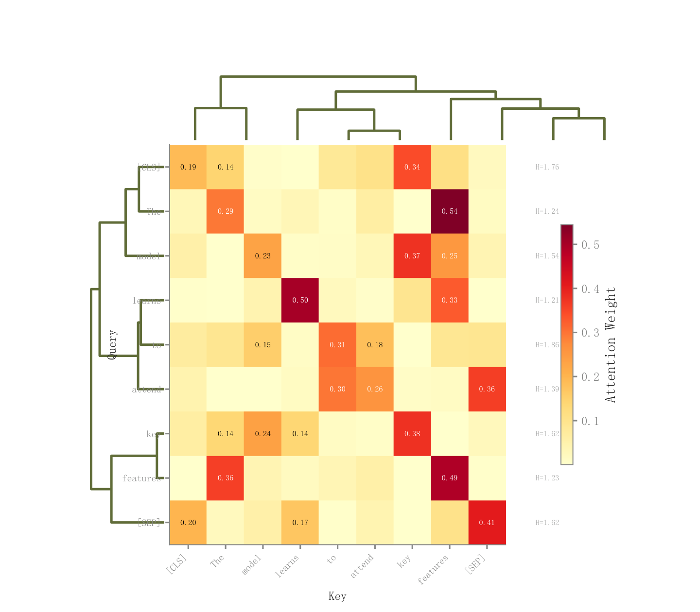

# 071 · 注意力矩阵与双侧聚类树

ID：`academic.attention_heatmap`

用途：Query对Key的权重怎样分配？

标签：解释、矩阵、聚类

别名：注意力矩阵与双侧聚类树

## 数据要求

- 注意力权重矩阵
- 行列token
- 可选熵统计

## 组合结构

热图＋顶部及左侧树；右侧熵与色条

## 视觉特点

- 黄红色阶
- 较大权重数字
- 白格线

## 适配注意

树与矩阵顺序需核对；左侧标签靠近树；聚类后需保留token对应关系。

## 预览

## 来源与核对

原名称：Attention Heatmap — 注意力热力图
原始代码：[查看](../sources/academic.attention_heatmap/original.html)
预览范围：首个主要Python示例
已查看对应预览并核对主要绘图和数据代码；卡片不是统计有效性认证。

<!-- fidelity:start -->
## 源码保真要点

以当前完整配方源码为底稿；下列行号指向解释预览的快照。数据适配不应顺手删掉这些视觉结构。

### 注意力矩阵与边侧摘要

- 保留重点：保留热图与聚类树对应关系、较大权重注释、侧熵摘要与色条，不仅画矩阵。
- 可适配：token 数、重排和字体可变；注意力归一化与熵计算来自真实权重。
- 源码：[L26–27](../sources/academic.attention_heatmap/original.html#L26) · [L36–37](../sources/academic.attention_heatmap/original.html#L36) · [L45–45](../sources/academic.attention_heatmap/original.html#L45) · [L65–65](../sources/academic.attention_heatmap/original.html#L65)

按现有审图流程对照实际输出；有疑问时可用[源码差异提示](../../template-fidelity.md)。
