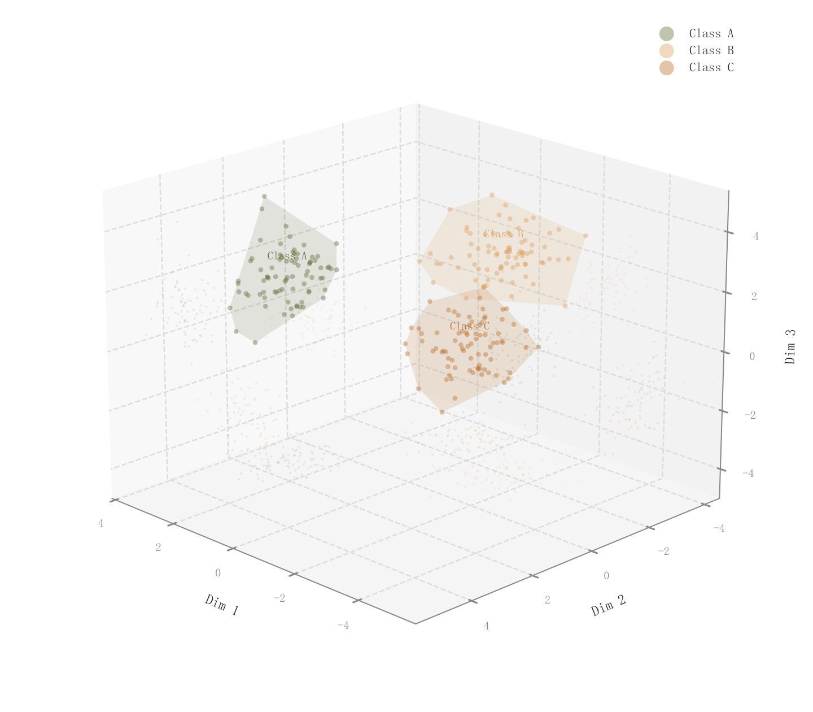

# 078 · 三维分组点云与凸包投影

ID：`academic.benchmark_table`

用途：三维特征中的类别分离与包络怎样？

标签：三维、聚类、组合

别名：3d clusters、convex hull、三维凸包

## 数据要求

- 三维坐标和组标签

## 组合结构

3D分组散点；透明凸包与平面投影

## 视觉特点

- 半透明空间包络
- 细点云
- 投影辅助空间理解

## 适配注意

原ID和标题称基准表，实际为3D簇；凸包非置信域；退化共面数据可能不适合凸包。

## 预览

## 来源与核对

原名称：Multi-Dataset Benchmark Table — 多数据集基准表
原始代码：[查看](../sources/academic.benchmark_table/original.html)
预览范围：首个主要Python示例
已查看对应预览并核对主要绘图和数据代码；卡片不是统计有效性认证。

原索引标题与实际图型不一致；此卡按实图描述，原ID保持不变。

## 相近候选

- [三维分组散点](competition.cluster_3d.md)
- [二维嵌入簇与密度轮廓](academic.tsne_umap.md)
- [聚类分布与轮廓系数双面板](competition.kmeans.md)

<!-- fidelity:start -->
## 源码保真要点

以当前完整配方源码为底稿；下列行号指向解释预览的快照。数据适配不应顺手删掉这些视觉结构。

### 实际是三维点云与凸包

- 保留重点：保留小透明点、alpha=0.08 空间凸包与三个平面的浅投影，不简化成普通三维散点。
- 可适配：组数、凸包、投影偏移及视角由真实数据适配；退化凸包允许省略并说明。
- 源码：[L24–25](../sources/academic.benchmark_table/original.html#L24) · [L34–35](../sources/academic.benchmark_table/original.html#L34) · [L43–44](../sources/academic.benchmark_table/original.html#L43) · [L46–47](../sources/academic.benchmark_table/original.html#L46) · [L49–50](../sources/academic.benchmark_table/original.html#L49)

按现有审图流程对照实际输出；有疑问时可用[源码差异提示](../../template-fidelity.md)。
