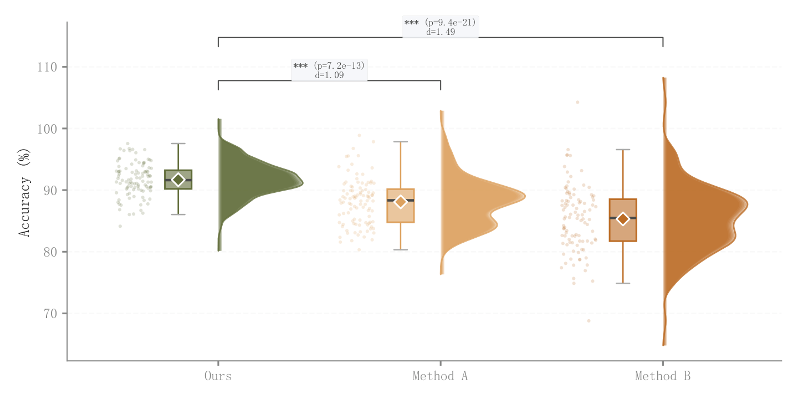

# 074 · 雨云分布与效应量显著性

ID：`academic.confusion_matrix`

用途：模型重复结果的分布与差异强度如何？

标签：分布、比较、组合

别名：raincloud、效应量、Cohen d、半小提琴

## 数据要求

- 各方法原始连续样本
- 检验与效应量计算口径

## 组合结构

竖向半小提琴、箱线、抖动散点；顶部比较括号

## 视觉特点

- 透明琴体
- 均值标记
- p值和Cohen's d

## 适配注意

原ID和标题称混淆矩阵，实际为雨云图；不是分类计数矩阵，不能从汇总准确率恢复分布。

## 预览

## 来源与核对

原名称：Confusion Matrix — 混淆矩阵
原始代码：[查看](../sources/academic.confusion_matrix/original.html)
预览范围：首个主要Python示例
已查看对应预览并核对主要绘图和数据代码；卡片不是统计有效性认证。

原索引标题与实际图型不一致；此卡按实图描述，原ID保持不变。

## 相近候选

- [竖向雨云分布组合](basic.raincloud.md)
- [完整小提琴与箱线显著性比较](basic.raincloud_violin.md)
- [类别内多方法小提琴](advanced.grouped_violin.md)
- [堆叠山脊密度](advanced.ridgeline.md)
- [横向长尾分布雨云与分位标记](empirical.raincloud.md)
- [模型误差横向雨云](empirical.prediction_error_raincloud.md)

<!-- fidelity:start -->
## 源码保真要点

以当前完整配方源码为底稿；下列行号指向解释预览的快照。数据适配不应顺手删掉这些视觉结构。

### 实际是带检验的雨云

- 保留重点：按真实源码保留分层半小提琴、左侧窄箱和散点、均值菱形及有统计依据的比较括号，不按旧标题画混淆矩阵。
- 可适配：组数、间距、密度带宽可变；p 值和效应量由当前样本正确计算。
- 源码：[L32–33](../sources/academic.confusion_matrix/original.html#L32) · [L34–34](../sources/academic.confusion_matrix/original.html#L34) · [L37–43](../sources/academic.confusion_matrix/original.html#L37) · [L47–47](../sources/academic.confusion_matrix/original.html#L47) · [L50–51](../sources/academic.confusion_matrix/original.html#L50) · [L55–55](../sources/academic.confusion_matrix/original.html#L55)

按现有审图流程对照实际输出；有疑问时可用[源码差异提示](../../template-fidelity.md)。
