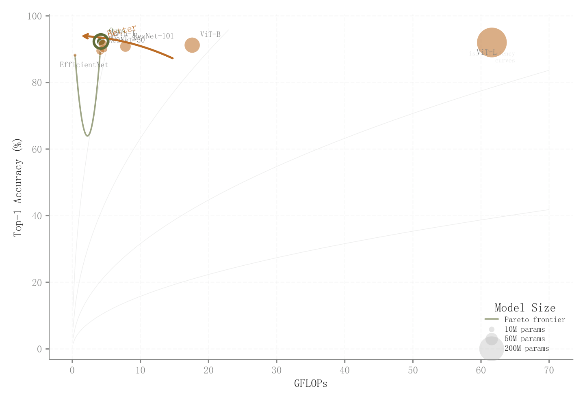

# 079 · 精度成本气泡与Pareto比较

ID：`academic.error_analysis`

用途：模型精度、算力与参数量如何权衡？

标签：比较、优化、多维

别名：accuracy efficiency tradeoff、Pareto bubbles、精度成本权衡

## 数据要求

- 各模型计算成本、准确率、参数量、名称

## 组合结构

成本—精度散点；气泡大小编码参数量

## 视觉特点

- 主模型外环
- 等效率参考线
- Pareto连线
- 大小图例

## 适配注意

实际不是误差分布；原三次样条Pareto连线明显下凹，不能视为真实可达前沿；左上标签较密。

## 预览

## 来源与核对

原名称：Error Analysis — 错误分析图
原始代码：[查看](../sources/academic.error_analysis/original.html)
预览范围：首个主要Python示例
已查看对应预览并核对主要绘图和数据代码；卡片不是统计有效性认证。

<!-- fidelity:start -->
## 源码保真要点

以当前完整配方源码为底稿；下列行号指向解释预览的快照。数据适配不应顺手删掉这些视觉结构。

### 气泡、外环与效率前沿

- 保留重点：保留参数量映射气泡大小、重点模型外环、参考效率线与前沿；不要全点同大或删掉外环。
- 可适配：成本、精度、参数规模、Pareto 集重算，连续连接不得伪造可达中间解。
- 源码：[L19–19](../sources/academic.error_analysis/original.html#L19) · [L27–28](../sources/academic.error_analysis/original.html#L27) · [L36–37](../sources/academic.error_analysis/original.html#L36) · [L61–62](../sources/academic.error_analysis/original.html#L61) · [L64–65](../sources/academic.error_analysis/original.html#L64) · [L67–68](../sources/academic.error_analysis/original.html#L67) · [L78–78](../sources/academic.error_analysis/original.html#L78)

按现有审图流程对照实际输出；有疑问时可用[源码差异提示](../../template-fidelity.md)。
