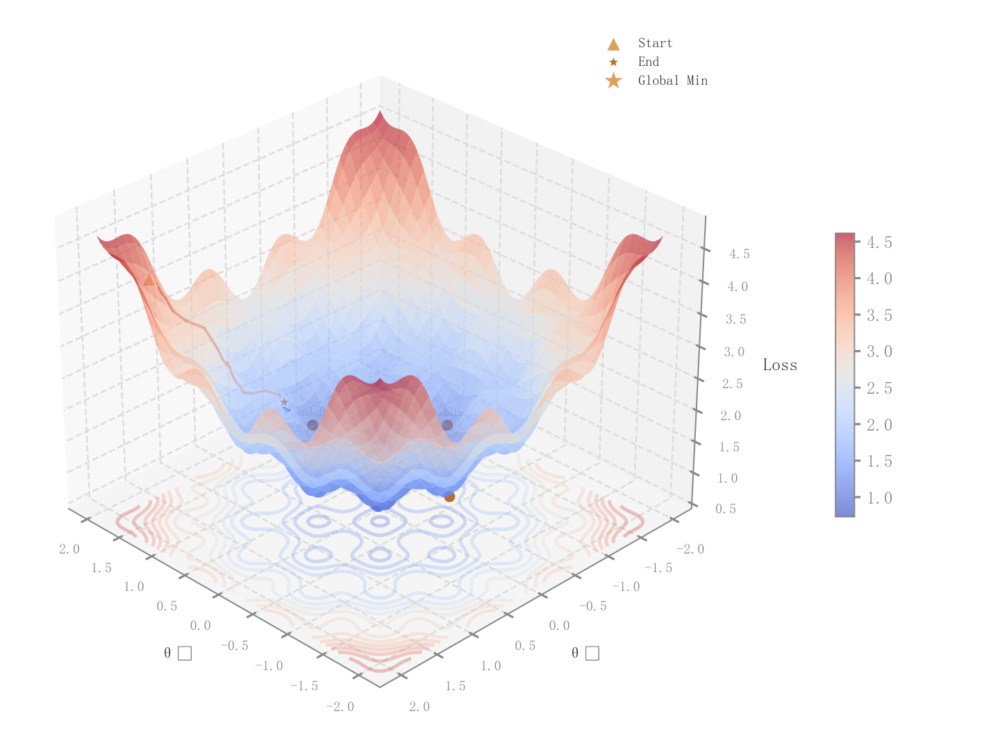

# 075 · 三维损失地形与优化轨迹

ID：`academic.feature_importance`

用途：优化路径如何穿越损失地形并到达低谷？

标签：优化、三维、组合

别名：loss landscape、optimization trajectory、损失地形

## 数据要求

- 二维参数网格与目标值
- 迭代路径及路径损失

## 组合结构

3D曲面；底部等高线；曲面上的轨迹

## 视觉特点

- 红蓝曲面
- 轨迹随步数变色
- 起止与最优标记

## 适配注意

原ID和标题称特征重要性，实际是损失曲面；地形与路径均为模拟，非SHAP结果。

## 预览

## 来源与核对

原名称：Feature Importance (SHAP-style) — 特征重要性
原始代码：[查看](../sources/academic.feature_importance/original.html)
预览范围：首个主要Python示例
已查看对应预览并核对主要绘图和数据代码；卡片不是统计有效性认证。

原索引标题与实际图型不一致；此卡按实图描述，原ID保持不变。

## 相近候选

- [三维目标曲面与底部等高线](competition.surface_3d.md)
- [双参数目标等高线](competition.contour.md)
- [二维可行性分区与约束边界](competition.feasible_region.md)

<!-- fidelity:start -->
## 源码保真要点

以当前完整配方源码为底稿；下列行号指向解释预览的快照。数据适配不应顺手删掉这些视觉结构。

### 实际是带轨迹的三维曲面

- 保留重点：保留半透明曲面、底部投影、随步数变化颜色的路径及起止标记；不要只剩一张无轨迹曲面。
- 可适配：网格、视角、连续色相可变；轨迹高度、起止和最优点重新计算，不复制示例的最优坐标。
- 源码：[L14–15](../sources/academic.feature_importance/original.html#L14) · [L18–18](../sources/academic.feature_importance/original.html#L18) · [L42–43](../sources/academic.feature_importance/original.html#L42) · [L46–47](../sources/academic.feature_importance/original.html#L46) · [L48–49](../sources/academic.feature_importance/original.html#L48) · [L52–53](../sources/academic.feature_importance/original.html#L52) · [L59–60](../sources/academic.feature_importance/original.html#L59)

按现有审图流程对照实际输出；有疑问时可用[源码差异提示](../../template-fidelity.md)。
