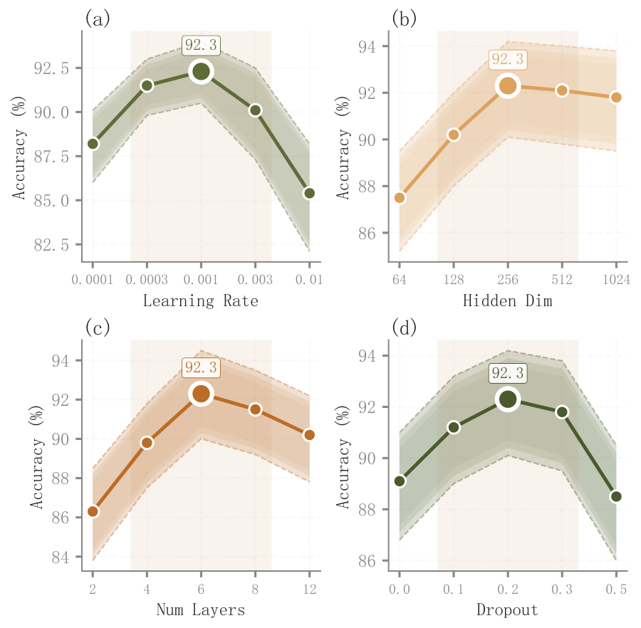

# 073 · 超参数性能四面板

ID：`academic.hyperparameter_sensitivity`

用途：多个超参数各自的优选范围在哪里？

标签：优化、比较、误差、组合

别名：超参数性能四面板

## 数据要求

- 每参数的取值网格
- 表现均值、最小值和最大值

## 组合结构

2×2，每格一个超参数

## 视觉特点

- 三层范围带
- 上下边界虚线
- 最佳点白环
- 优选区域阴影

## 适配注意

示例范围是min/max，非自动统计CI；横坐标按档位等距，需注意真实数值间距。

## 预览

## 来源与核对

原名称：Hyperparameter Sensitivity — 超参数灵敏度图
原始代码：[查看](../sources/academic.hyperparameter_sensitivity/original.html)
预览范围：首个主要Python示例
已查看对应预览并核对主要绘图和数据代码；卡片不是统计有效性认证。

<!-- fidelity:start -->
## 源码保真要点

以当前完整配方源码为底稿；下列行号指向解释预览的快照。数据适配不应顺手删掉这些视觉结构。

### 四面板范围与最优环

- 保留重点：保留三层范围带、上下边界虚线、均值线、最佳点白环和有依据的优选区域。
- 可适配：超参数数目、类别或数值轴、范围及最优方向可变；从重复结果得到区间而非随机生成。
- 源码：[L34–37](../sources/academic.hyperparameter_sensitivity/original.html#L34) · [L40–40](../sources/academic.hyperparameter_sensitivity/original.html#L40) · [L41–41](../sources/academic.hyperparameter_sensitivity/original.html#L41) · [L44–45](../sources/academic.hyperparameter_sensitivity/original.html#L44) · [L49–50](../sources/academic.hyperparameter_sensitivity/original.html#L49) · [L55–56](../sources/academic.hyperparameter_sensitivity/original.html#L55)

按现有审图流程对照实际输出；有疑问时可用[源码差异提示](../../template-fidelity.md)。
