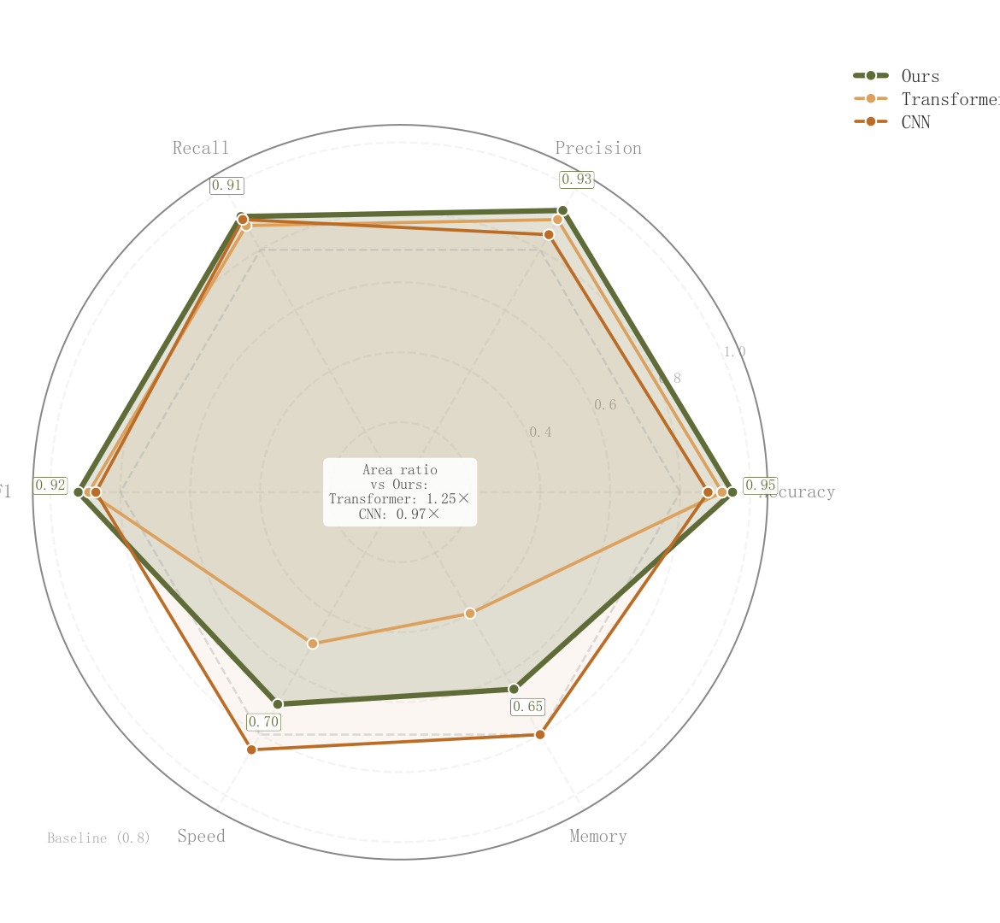

# 077 · 归一化多指标雷达对比

ID：`academic.latent_interpolation`

用途：不同方法的能力轮廓与短板怎样？

标签：比较、多维

别名：radar、雷达图、能力轮廓

## 数据要求

- 方法×归一化指标
- 指标顺序及高低优方向

## 组合结构

极坐标闭合多边形叠加

## 视觉特点

- 透明面填充
- 阈值环
- 主方法数值
- 中心面积摘要

## 适配注意

原ID和标题称隐空间插值，实际是雷达图；面积随指标顺序变化，不宜作为独立严谨综合分。

## 预览

## 来源与核对

原名称：Latent Space Interpolation — 隐空间插值
原始代码：[查看](../sources/academic.latent_interpolation/original.html)
预览范围：首个主要Python示例
已查看对应预览并核对主要绘图和数据代码；卡片不是统计有效性认证。

原索引标题与实际图型不一致；此卡按实图描述，原ID保持不变。

## 相近候选

- [多方案雷达与交替背景环](competition.radar.md)
- [多指标平行坐标](advanced.parallel_coordinates.md)
- [多指标方法排名热力图](advanced.method_heatmap.md)
- [多模型多指标预测热力排名](empirical.prediction_accuracy_heatmap.md)

<!-- fidelity:start -->
## 源码保真要点

以当前完整配方源码为底稿；下列行号指向解释预览的快照。数据适配不应顺手删掉这些视觉结构。

### 实际是透明雷达叠面

- 保留重点：保留闭合多边形的透明叠加、阈值环和主方法数值，不压成只有轮廓的雷达线。
- 可适配：指标数、量纲归一化和主方法可变；阈值及面积摘要需有明确解释。
- 源码：[L29–29](../sources/academic.latent_interpolation/original.html#L29) · [L30–31](../sources/academic.latent_interpolation/original.html#L30) · [L38–39](../sources/academic.latent_interpolation/original.html#L38) · [L40–40](../sources/academic.latent_interpolation/original.html#L40) · [L46–49](../sources/academic.latent_interpolation/original.html#L46) · [L56–60](../sources/academic.latent_interpolation/original.html#L56)

按现有审图流程对照实际输出；有疑问时可用[源码差异提示](../../template-fidelity.md)。
