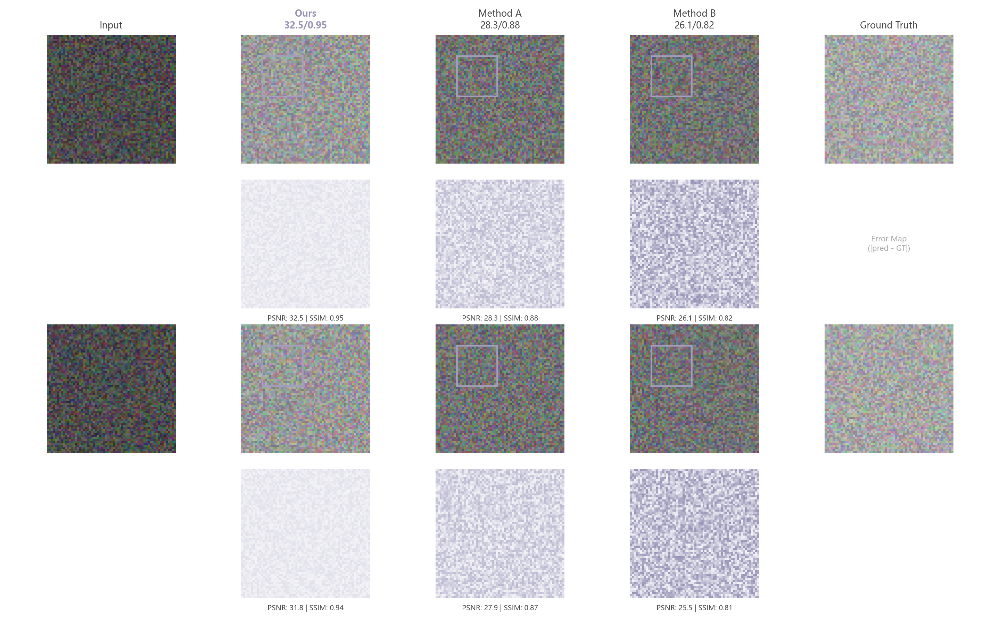

# 076 · 图像重建与误差多面板

ID：`academic.learning_rate`

用途：各方法的重建细节与误差集中在哪些位置？

标签：图像、比较、组合

别名：reconstruction comparison、error maps、图像重建比较

## 数据要求

- 同一场景输入、参考图和各方法输出
- 误差图
- 评价指标

## 组合结构

场景行块×方法列；结果行与误差行交替

## 视觉特点

- 局部框选
- 方法列对齐
- 误差热图
- 指标标题

## 适配注意

原ID和标题称学习率调度，实际为图像对比；示例图与指标是模拟，局部框不等于已放大视图。

## 预览

## 来源与核对

原名称：Learning Rate Schedule — 学习率调度曲线
原始代码：[查看](../sources/academic.learning_rate/original.html)
预览范围：首个主要Python示例
已查看对应预览并核对主要绘图和数据代码；卡片不是统计有效性认证。

原索引标题与实际图型不一致；此卡按实图描述，原ID保持不变。

<!-- fidelity:start -->
## 源码保真要点

以当前完整配方源码为底稿；下列行号指向解释预览的快照。数据适配不应顺手删掉这些视觉结构。

### 实际是图像与误差矩阵

- 保留重点：保留场景行块、方法列、结果与误差行交替，以及局部框选；对应图像位置应对齐。
- 可适配：方法与场景数量、图像尺寸可变；误差尺度在可比面板一致，框选来自真实相同区域。
- 源码：[L35–35](../sources/academic.learning_rate/original.html#L35) · [L40–41](../sources/academic.learning_rate/original.html#L40) · [L62–62](../sources/academic.learning_rate/original.html#L62)

按现有审图流程对照实际输出；有疑问时可用[源码差异提示](../../template-fidelity.md)。

## 项目配色

热图默认读取项目配色；连续插值、中性色、透明度及数据归一化保留，数值文字按实际底色选择对比色。
