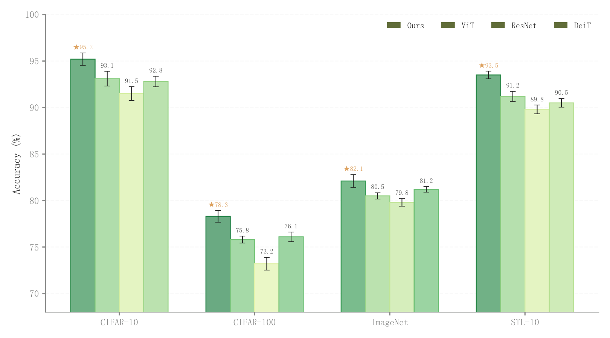

# 072 · 多数据集分组性能柱图

ID：`academic.radar`

用途：同一组模型在多个数据集上的表现怎样？

标签：比较、误差

别名：grouped benchmark bar、跨数据集方法比较

## 数据要求

- 方法×数据集得分矩阵
- 误差长度

## 组合结构

按数据集分组的并排柱

## 视觉特点

- 每数据集内按得分变化的绿色深浅
- 误差棒
- 最优星号

## 适配注意

原ID和标题称雷达图，但实际为柱图；色深映射数值，不能仅凭颜色图例识别方法。

## 预览

## 来源与核对

原名称：Architecture Comparison Radar — 架构对比雷达图
原始代码：[查看](../sources/academic.radar/original.html)
预览范围：首个主要Python示例
已查看对应预览并核对主要绘图和数据代码；卡片不是统计有效性认证。

原索引标题与实际图型不一致；此卡按实图描述，原ID保持不变。

预览执行兼容调整：RGB/RGBA 元组转十六进制以适配原 _lighten 接口，颜色含义不变

<!-- fidelity:start -->
## 源码保真要点

以当前完整配方源码为底稿；下列行号指向解释预览的快照。数据适配不应顺手删掉这些视觉结构。

### 实际是分组得分柱

- 保留重点：按这个 ID 的真实源码保留并排柱、数据驱动的绿色深浅、浅填充深边、误差棒与最优标记；不要按旧标题改画雷达。
- 可适配：方法、数据集、连续色相和布局可变；误差来源与最优方向按当前数据确定。
- 源码：[L27–29](../sources/academic.radar/original.html#L27) · [L34–37](../sources/academic.radar/original.html#L34) · [L41–41](../sources/academic.radar/original.html#L41)

按现有审图流程对照实际输出；有疑问时可用[源码差异提示](../../template-fidelity.md)。
