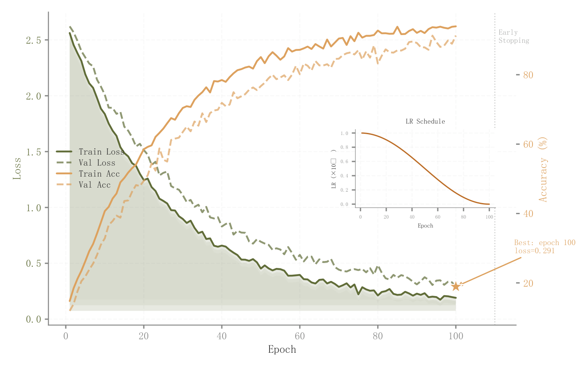

# 069 · 损失准确率双轴与学习率插图

ID：`academic.training_curves`

用途：训练验证过程、最佳轮次和学习率如何关联？

标签：训练、趋势、诊断、组合

别名：损失准确率双轴与学习率插图

## 数据要求

- epoch
- 训练验证损失与指标
- 学习率序列

## 组合结构

主图双轴四曲线；右侧学习率小窗

## 视觉特点

- 损失下三层透明填充
- 最佳轮次星号
- 早停线

## 适配注意

示例早停为最佳轮次加10，未运行早停算法；图例靠近曲线；不是独立学习率调度模板。

## 预览

## 来源与核对

原名称：Training Curves — 训练曲线（Loss + Metric 双轴）
原始代码：[查看](../sources/academic.training_curves/original.html)
预览范围：首个主要Python示例
已查看对应预览并核对主要绘图和数据代码；卡片不是统计有效性认证。

## 相近候选

- [多算法迭代收敛曲线](competition.convergence.md)
- [Dolan–Moré性能剖面](advanced.performance_profile.md)

<!-- fidelity:start -->
## 源码保真要点

以当前完整配方源码为底稿；下列行号指向解释预览的快照。数据适配不应顺手删掉这些视觉结构。

### 损失填充与学习率小窗

- 保留重点：保留双轴训练/验证线型差异、损失下三层填充、最佳点与学习率小窗。
- 可适配：轮次、学习率、早停和最优位置来自实际日志；透明填充是视觉层，不伪装为重复试验波动。
- 源码：[L21–21](../sources/academic.training_curves/original.html#L21) · [L22–23](../sources/academic.training_curves/original.html#L22) · [L26–28](../sources/academic.training_curves/original.html#L26) · [L31–31](../sources/academic.training_curves/original.html#L31) · [L32–33](../sources/academic.training_curves/original.html#L32) · [L37–38](../sources/academic.training_curves/original.html#L37) · [L49–49](../sources/academic.training_curves/original.html#L49) · [L56–56](../sources/academic.training_curves/original.html#L56)

按现有审图流程对照实际输出；有疑问时可用[源码差异提示](../../template-fidelity.md)。
