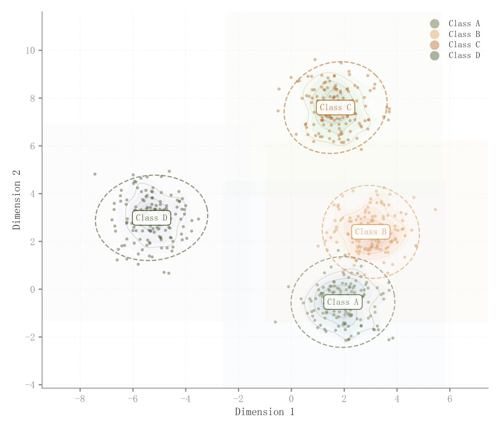

# 070 · 二维嵌入簇与密度轮廓

ID：`academic.tsne_umap`

用途：二维嵌入中类别是否分离和混杂？

标签：降维、聚类、分布

别名：二维嵌入簇与密度轮廓

## 数据要求

- 已有二维嵌入坐标
- 类别标签

## 组合结构

分组散点；类内密度轮廓与包络

## 视觉特点

- 透明点云
- 虚线轮廓
- 类中心标签

## 适配注意

代码直接模拟二维簇，未计算t-SNE/UMAP；轮廓不自动代表置信区域。

## 预览

## 来源与核对

原名称：t-SNE / UMAP Visualization — 降维可视化
原始代码：[查看](../sources/academic.tsne_umap/original.html)
预览范围：首个主要Python示例
已查看对应预览并核对主要绘图和数据代码；卡片不是统计有效性认证。

## 相近候选

- [三维分组点云与凸包投影](academic.benchmark_table.md)
- [三维分组散点](competition.cluster_3d.md)
- [聚类分布与轮廓系数双面板](competition.kmeans.md)

<!-- fidelity:start -->
## 源码保真要点

以当前完整配方源码为底稿；下列行号指向解释预览的快照。数据适配不应顺手删掉这些视觉结构。

### 点云、密度与类包络

- 保留重点：保留透明点云、浅类内密度、轮廓/包络与中心标签，不把所有类统一成实色点。
- 可适配：类数、降维坐标和密度带宽可变；小样本或退化类不强行拟合包络，连续背景色按当前指导适配。
- 源码：[L32–34](../sources/academic.tsne_umap/original.html#L32) · [L35–35](../sources/academic.tsne_umap/original.html#L35) · [L42–44](../sources/academic.tsne_umap/original.html#L42) · [L48–49](../sources/academic.tsne_umap/original.html#L48)

按现有审图流程对照实际输出；有疑问时可用[源码差异提示](../../template-fidelity.md)。
