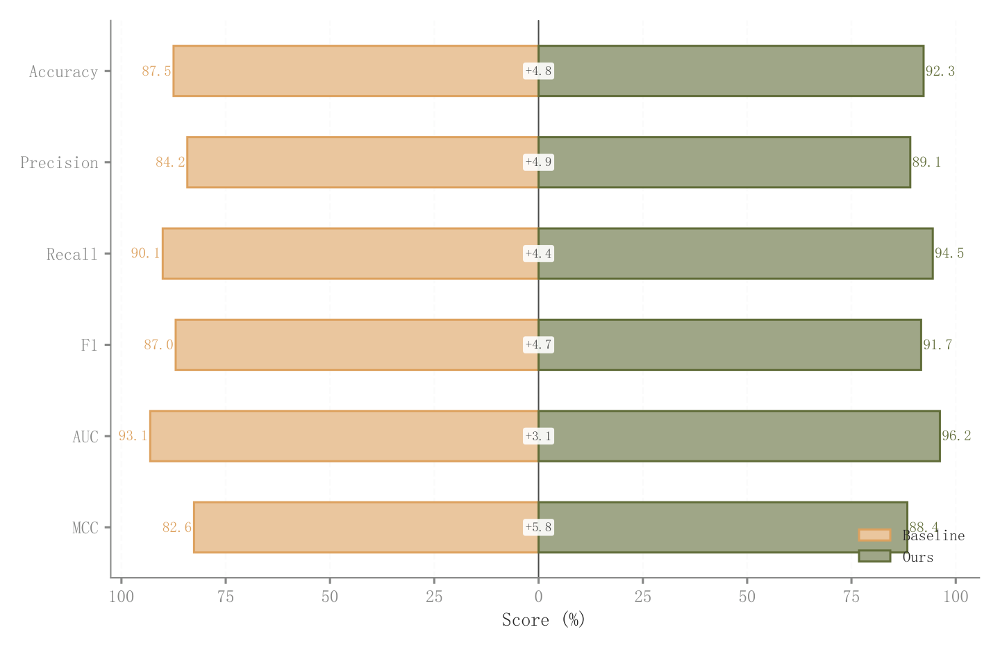

# 033 · 两组镜像条形比较

ID：`advanced.back_to_back_bar`

用途：两个群体在多个指标上的差距怎样？

标签：比较、组合

别名：两组镜像条形比较

## 数据要求

- 每个指标的两组非负值

## 组合结构

共享类别轴；左右镜像横条

## 视觉特点

- 浅填充深描边
- 中心差值框
- 左右数值标签

## 适配注意

左侧负坐标仅用于镜像，实际量仍为正；不同单位指标需先可比化。

## 预览

## 来源与核对

原名称：Back-to-Back Bar Chart — 背靠背柱状图（浅色填充 + 原色边框 + 镜像对比 + 共享 Y 轴 + 差值标签）
原始代码：[查看](../sources/advanced.back_to_back_bar/original.html)
预览范围：首个主要Python示例
已查看对应预览并核对主要绘图和数据代码；卡片不是统计有效性认证。

<!-- fidelity:start -->
## 源码保真要点

以当前完整配方源码为底稿；下列行号指向解释预览的快照。数据适配不应顺手删掉这些视觉结构。

### 镜像条与中央差值

- 保留重点：保留共享类别轴的两侧镜像条、浅填充深边与中央比较信息，不改成互相覆盖的同向柱。
- 可适配：两组数据和行数可变，轴标签显示真实绝对量，镜像负坐标不代表负数据。
- 源码：[L16–18](../sources/advanced.back_to_back_bar/original.html#L16) · [L20–22](../sources/advanced.back_to_back_bar/original.html#L20) · [L26–27](../sources/advanced.back_to_back_bar/original.html#L26) · [L28–29](../sources/advanced.back_to_back_bar/original.html#L28) · [L33–36](../sources/advanced.back_to_back_bar/original.html#L33) · [L40–40](../sources/advanced.back_to_back_bar/original.html#L40)

按现有审图流程对照实际输出；有疑问时可用[源码差异提示](../../template-fidelity.md)。
