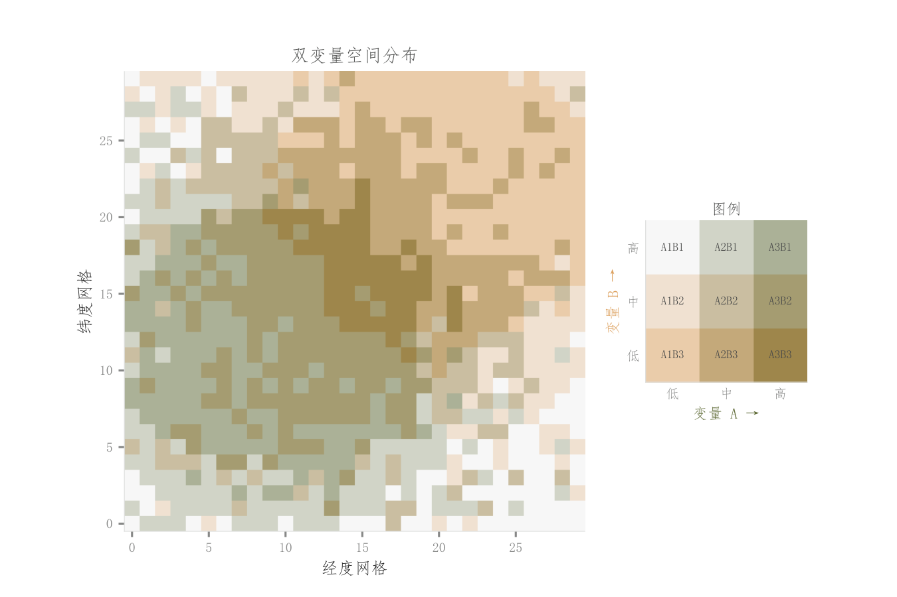

# 046 · 双变量空间网格与九宫格图例

ID：`advanced.bivariate_choropleth`

用途：两个变量在空间上哪些地方同时高或低？

标签：空间、矩阵、多维

别名：bivariate grid、双变量地图、九宫格图例

## 数据要求

- 同网格的两张数值矩阵

## 组合结构

左空间格网；右3×3双变量图例

## 视觉特点

- 两主色混合成九级离散色
- 浅底格网

## 适配注意

当前实现是规则网格而非行政区地图；原图例B轴高低方向与构造次序需核对；分位等级不表达绝对差距。

## 预览

## 来源与核对

原名称：Bivariate Choropleth / 双变量热图 — 二维联合分布（3×3 配色矩阵 + 主图 + 图例）
原始代码：[查看](../sources/advanced.bivariate_choropleth/original.html)
预览范围：首个主要Python示例
已查看对应预览并核对主要绘图和数据代码；卡片不是统计有效性认证。

<!-- fidelity:start -->
## 源码保真要点

以当前完整配方源码为底稿；下列行号指向解释预览的快照。数据适配不应顺手删掉这些视觉结构。

### 双变量九格混色

- 保留重点：保留双变量分级混色与对应的 3×3 图例，两个图例方向分别解释一个变量，不换成单变量连续色条。
- 可适配：分位阈值、空间格网和混色端点可调整；确保每格类别与图例一致。
- 源码：[L40–40](../sources/advanced.bivariate_choropleth/original.html#L40) · [L53–53](../sources/advanced.bivariate_choropleth/original.html#L53) · [L66–67](../sources/advanced.bivariate_choropleth/original.html#L66)

按现有审图流程对照实际输出；有疑问时可用[源码差异提示](../../template-fidelity.md)。
