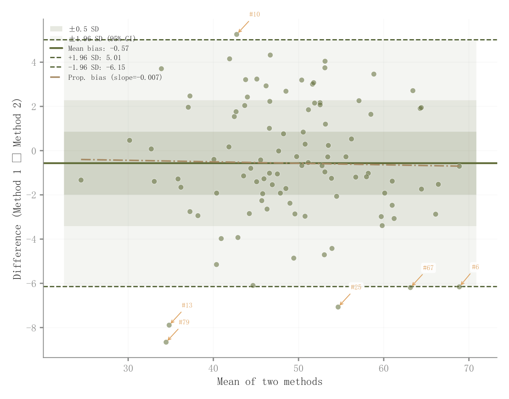

# 020 · Bland–Altman一致性图

ID：`advanced.bland_altman`

用途：两种测量方法是否一致，偏差是否随量级变化？

标签：关联、误差

别名：Bland Altman、方法一致性

## 数据要求

- 同一样本的两种测量值

## 组合结构

均值横轴、差值纵轴；偏差与一致性界限

## 视觉特点

- 嵌套透明水平带
- 比例偏差线
- 异常点标签

## 适配注意

带状区域主要按差值标准差绘制，不应笼统称为参数估计CI；一致性不等于高相关。

## 预览

## 来源与核对

原名称：Bland-Altman Plot — Bland-Altman 一致性图（分层 CI 带 + 比例偏差线 + 异常值标签）
原始代码：[查看](../sources/advanced.bland_altman/original.html)
预览范围：首个主要Python示例
已查看对应预览并核对主要绘图和数据代码；卡片不是统计有效性认证。

<!-- fidelity:start -->
## 源码保真要点

以当前完整配方源码为底稿；下列行号指向解释预览的快照。数据适配不应顺手删掉这些视觉结构。

### 一致性界限与嵌套浅带

- 保留重点：保留均值差、界限线、三档浅色水平区和透明白边散点，不简化成一条回归线。
- 可适配：差值方向、SD 与一致性限按配对数据计算；一致性限不是均值置信区间，标签应准确。
- 源码：[L26–27](../sources/advanced.bland_altman/original.html#L26) · [L29–30](../sources/advanced.bland_altman/original.html#L29) · [L32–32](../sources/advanced.bland_altman/original.html#L32) · [L35–36](../sources/advanced.bland_altman/original.html#L35) · [L39–40](../sources/advanced.bland_altman/original.html#L39) · [L42–43](../sources/advanced.bland_altman/original.html#L42) · [L44–45](../sources/advanced.bland_altman/original.html#L44) · [L51–52](../sources/advanced.bland_altman/original.html#L51)

按现有审图流程对照实际输出；有疑问时可用[源码差异提示](../../template-fidelity.md)。
