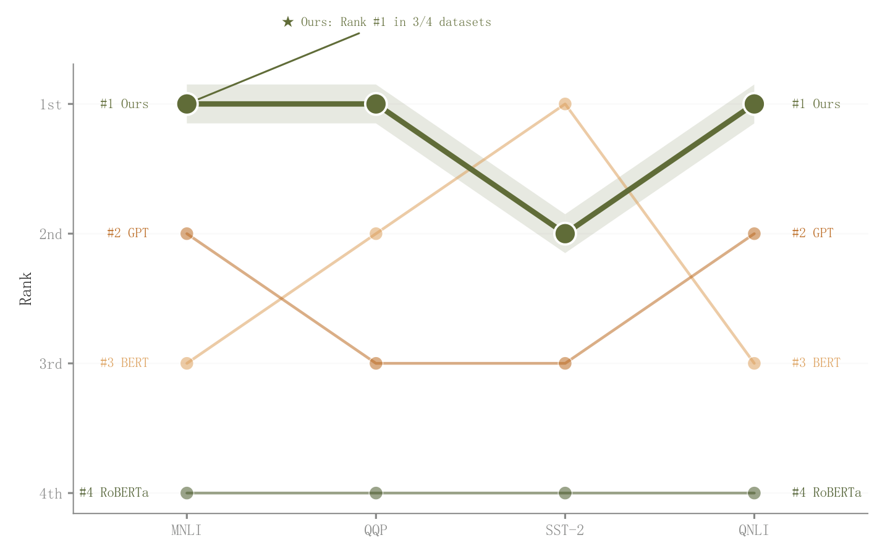

# 016 · 多阶段名次轨迹

ID：`advanced.bump`

用途：多个阶段谁领先，排名如何交换？

标签：排序、趋势

别名：多阶段名次轨迹

## 数据要求

- 方法×阶段的名次或可转换为名次的表现

## 组合结构

横向阶段；纵向排名；多条名次折线

## 视觉特点

- 主方法粗线与透明宽带
- 两端名次标签

## 适配注意

宽带是高亮，不是误差；名次间距不反映原得分差距。

## 预览

## 来源与核对

原名称：Bump Chart — 凹凸图（色带高亮 + 两端排名标签 + "本文"高亮）
原始代码：[查看](../sources/advanced.bump/original.html)
预览范围：首个主要Python示例
已查看对应预览并核对主要绘图和数据代码；卡片不是统计有效性认证。

## 相近候选

- [个体配对变化与均值箭头](advanced.paired_dot.md)
- [前后对比哑铃图](advanced.dumbbell.md)
- [两阶段斜率与排名变化](advanced.slope.md)

<!-- fidelity:start -->
## 源码保真要点

以当前完整配方源码为底稿；下列行号指向解释预览的快照。数据适配不应顺手删掉这些视觉结构。

### 排名线的主次层次

- 保留重点：保留主方法粗线、浅宽带和两端名次标签；宽带用于高亮名次路径，不能误标为统计置信区间。
- 可适配：阶段、排名及主方法按数据替换；插值仅为连接视觉，不能改变实际阶段名次。
- 源码：[L28–29](../sources/advanced.bump/original.html#L28) · [L32–34](../sources/advanced.bump/original.html#L32)

按现有审图流程对照实际输出；有疑问时可用[源码差异提示](../../template-fidelity.md)。
