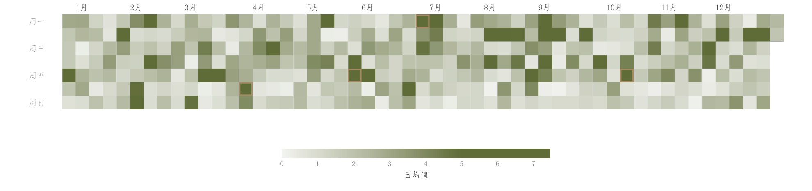

# 040 · 日历格点热图

ID：`advanced.calendar_heatmap`

用途：全年活动强度、周规律和异常日在哪里？

标签：时间、矩阵

别名：日历格点热图

## 数据要求

- 每日日期和值

## 组合结构

周列×星期行；月份分隔；横向色条

## 视觉特点

- 主色浅到深连续色阶
- 紧凑方格
- 异常日标注

## 适配注意

缺失日期不能当零；跨年、闰年和周编号边界需按实际日期适配。

## 预览

## 来源与核对

原名称：Calendar Heatmap — 日历热图（一年 7×53 网格 + 月份分隔 + 顶部色条）
原始代码：[查看](../sources/advanced.calendar_heatmap/original.html)
预览范围：首个主要Python示例
已查看对应预览并核对主要绘图和数据代码；卡片不是统计有效性认证。

<!-- fidelity:start -->
## 源码保真要点

以当前完整配方源码为底稿；下列行号指向解释预览的快照。数据适配不应顺手删掉这些视觉结构。

### 周日格网与连续深浅

- 保留重点：保留按周列/星期行排列的格网、浅到深连续色阶、月份边界和异常日框，不当普通矩阵任意重排。
- 可适配：日期跨度、量纲和色阶范围可变；无观测日期与零值区分，异常日按当前规则确定。
- 源码：[L42–43](../sources/advanced.calendar_heatmap/original.html#L42) · [L61–62](../sources/advanced.calendar_heatmap/original.html#L61) · [L73–75](../sources/advanced.calendar_heatmap/original.html#L73)

按现有审图流程对照实际输出；有疑问时可用[源码差异提示](../../template-fidelity.md)。
