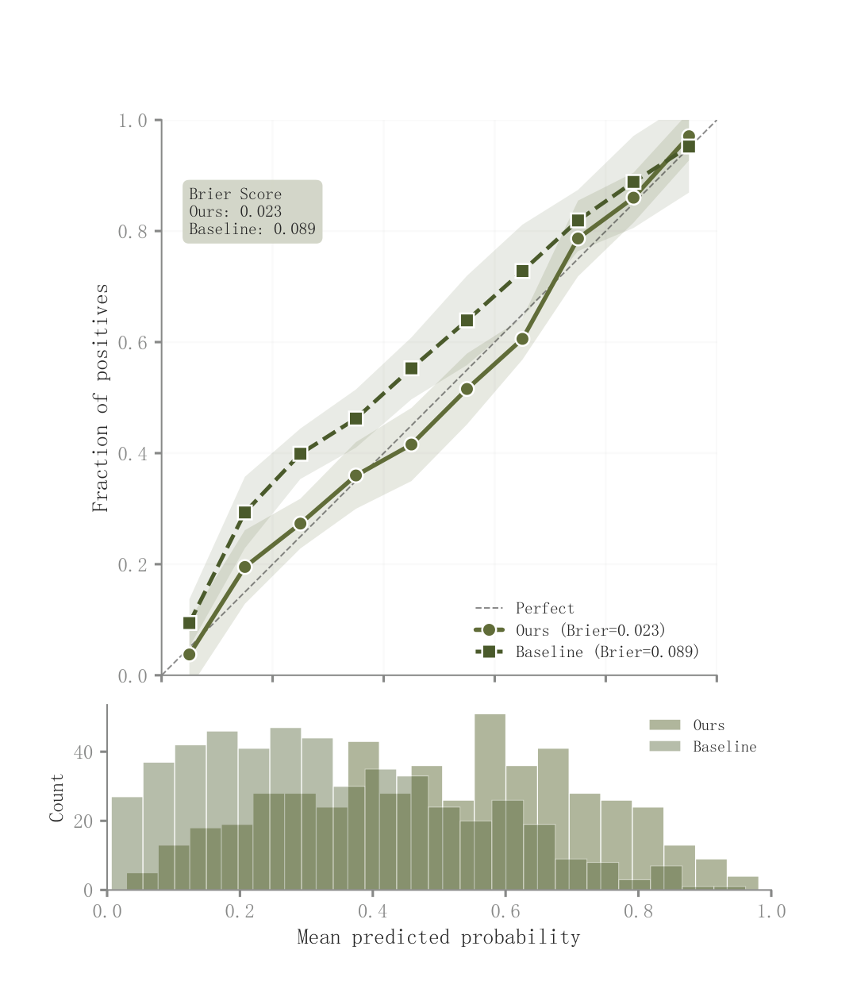

# 023 · 概率校准与预测概率分布

ID：`advanced.calibration`

用途：预测概率是否可靠，样本集中在哪些概率段？

标签：预测、诊断、组合

别名：reliability diagram、校准图、Brier

## 数据要求

- 预测概率与真实二分类结果
- 分箱统计及区间

## 组合结构

上方可靠性曲线；下方概率直方图；共享横轴

## 视觉特点

- 理想对角线
- 各曲线单层透明区间
- Brier摘要

## 适配注意

示例校准点、区间与Brier为演示输入；正式图需从同一批预测与标签计算，稀疏箱不宜强行平滑。

## 预览

## 来源与核对

原名称：Calibration Plot — 校准曲线（渐变 CI 带 + 底部直方图 + Brier Score 标注）
原始代码：[查看](../sources/advanced.calibration/original.html)
预览范围：首个主要Python示例
已查看对应预览并核对主要绘图和数据代码；卡片不是统计有效性认证。

## 相近候选

- [历史与预测分位数扇形图](advanced.fan.md)
- [时序预测与误差侧分布](empirical.prediction_ci.md)
- [预测对实际散点与下方残差分布](competition.prediction_actual.md)

<!-- fidelity:start -->
## 源码保真要点

以当前完整配方源码为底稿；下列行号指向解释预览的快照。数据适配不应顺手删掉这些视觉结构。

### 可靠性曲线加概率直方

- 保留重点：保留上方校准曲线的各自单层透明区间、不同点形/线型、理想线与下方概率直方。代码不是每条线多层渐变。
- 可适配：区间、分箱和 Brier 从实际概率与标签计算；两部分共享概率范围，面板尺寸可调且检查绘图区对齐。
- 源码：[L30–30](../sources/advanced.calibration/original.html#L30) · [L34–35](../sources/advanced.calibration/original.html#L34) · [L36–38](../sources/advanced.calibration/original.html#L36) · [L42–43](../sources/advanced.calibration/original.html#L42) · [L44–46](../sources/advanced.calibration/original.html#L44) · [L66–67](../sources/advanced.calibration/original.html#L66) · [L68–69](../sources/advanced.calibration/original.html#L68)

按现有审图流程对照实际输出；有疑问时可用[源码差异提示](../../template-fidelity.md)。
