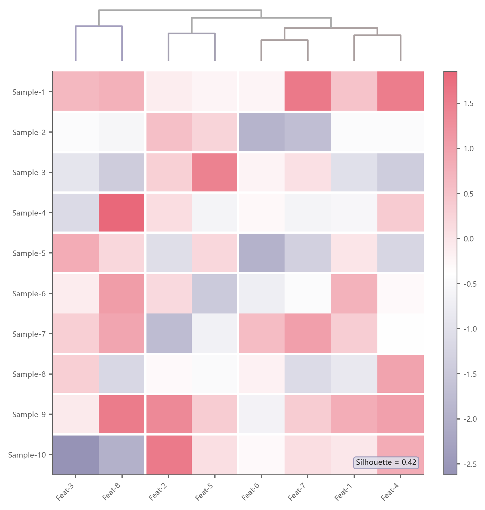

# 026 · 列聚类树与数值热力矩阵

ID：`advanced.cluster_heatmap`

用途：数值矩阵有哪些相似列和块结构？

标签：矩阵、聚类

别名：列聚类树与数值热力矩阵

## 数据要求

- 样本×特征矩阵
- 行列标签

## 组合结构

顶部列树状图；下方矩形热图；侧色条

## 视觉特点

- 红蓝色阶
- 白格线
- 聚类边界

## 适配注意

当前预览是首个主要示例；原章节另有双侧聚类变体尚无此图库预览；轮廓系数标注需核实真实计算。

## 预览

## 来源与核对

原名称：Cluster Heatmap — 聚类热力图（带树状图 + 聚类边界 + 轮廓系数标注）
原始代码：[查看](../sources/advanced.cluster_heatmap/original.html)
预览范围：首个主要Python示例
已查看对应预览并核对主要绘图和数据代码；卡片不是统计有效性认证。

<!-- fidelity:start -->
## 源码保真要点

以当前完整配方源码为底稿；下列行号指向解释预览的快照。数据适配不应顺手删掉这些视觉结构。

### 树状图与重排矩阵

- 保留重点：保留主要示例的顶部树状图、按聚类重排的热图、格线与色条，树叶顺序与矩阵列一致。
- 可适配：矩阵规模、聚类方法和色阶按数据选择；原章节另一个变体不受这个预览结构限制。
- 源码：[L30–32](../sources/advanced.cluster_heatmap/original.html#L30) · [L41–41](../sources/advanced.cluster_heatmap/original.html#L41) · [L60–60](../sources/advanced.cluster_heatmap/original.html#L60)

按现有审图流程对照实际输出；有疑问时可用[源码差异提示](../../template-fidelity.md)。

## 项目配色

热图默认读取项目配色；连续插值、中性色、透明度及数据归一化保留，数值文字按实际底色选择对比色。
