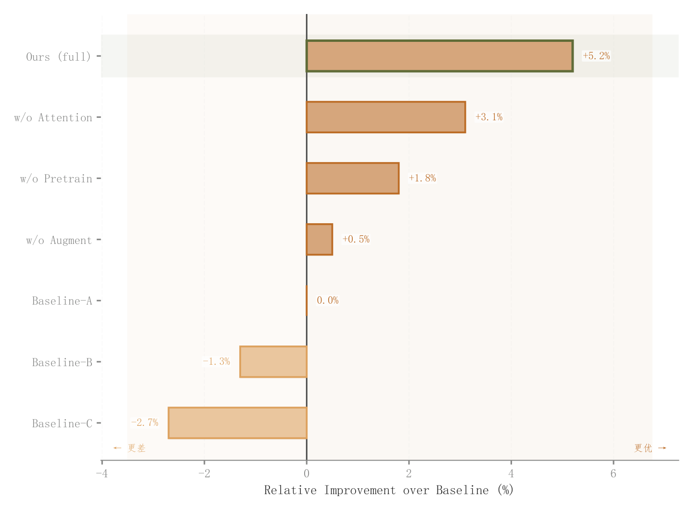

# 032 · 相对基线发散条形

ID：`advanced.diverging_bar`

用途：各方法比基线好或差多少？

标签：比较、变化

别名：相对基线发散条形

## 数据要求

- 类别与有正负的相对变化值

## 组合结构

零线两侧横向条形

## 视觉特点

- 方向配色
- 浅填充深描边
- 正负背景
- 主方法行高亮

## 适配注意

统一改善方向与百分比口径；不是组成堆叠图。

## 预览

## 来源与核对

原名称：Diverging Bar Chart — 发散柱状图（淡色填充 + 原色边框 + 相对基线 + 颜色编码方向 + 数值标签）
原始代码：[查看](../sources/advanced.diverging_bar/original.html)
预览范围：首个主要Python示例
已查看对应预览并核对主要绘图和数据代码；卡片不是统计有效性认证。

## 相近候选

- [累计增益阶梯与贡献色带](advanced.waterfall.md)
- [增减贡献浮动柱瀑布](competition.waterfall.md)
- [消融配置柱状比较](academic.ablation.md)

<!-- fidelity:start -->
## 源码保真要点

以当前完整配方源码为底稿；下列行号指向解释预览的快照。数据适配不应顺手删掉这些视觉结构。

### 两向浅条与深边

- 保留重点：保留零线两侧方向配色、浅填充深描边及后方阴影，正负背景和重点行仍可区分。
- 可适配：类别数、排序、范围与重点对象可变；方向按真实差值解释，不固定谁有优势。
- 源码：[L16–16](../sources/advanced.diverging_bar/original.html#L16) · [L17–17](../sources/advanced.diverging_bar/original.html#L17) · [L23–23](../sources/advanced.diverging_bar/original.html#L23) · [L25–27](../sources/advanced.diverging_bar/original.html#L25) · [L42–42](../sources/advanced.diverging_bar/original.html#L42)

按现有审图流程对照实际输出；有疑问时可用[源码差异提示](../../template-fidelity.md)。
