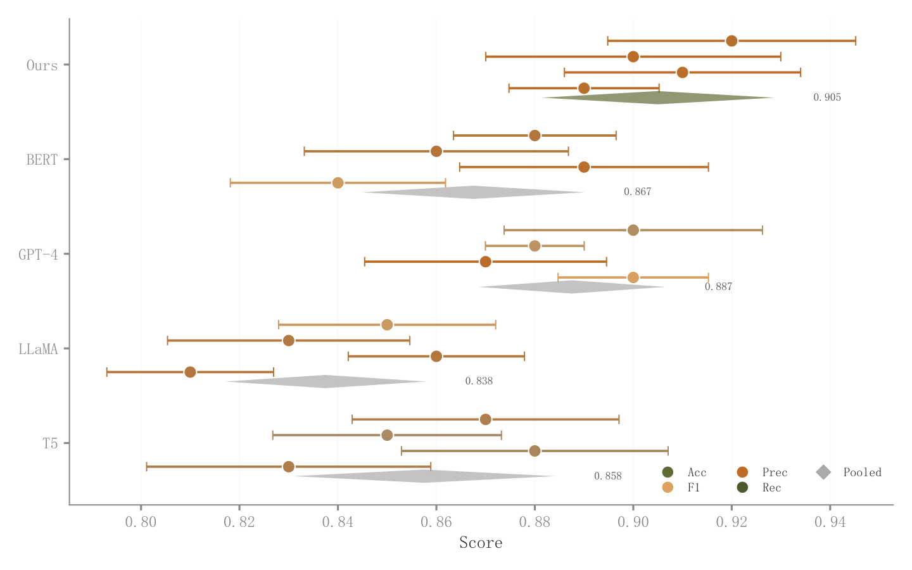

# 025 · 多指标点区间与汇总菱形

ID：`advanced.dot_ci`

用途：每个方法的多个指标及区间如何比较？

标签：比较、误差、组合

别名：多指标点区间与汇总菱形

## 数据要求

- 方法×指标得分
- 各项CI
- 可选p值与汇总量

## 组合结构

每方法一行；多个错位点区间；汇总菱形

## 视觉特点

- 点色随模拟显著性
- 菱形摘要
- 轻量网格

## 适配注意

不同单位先统一可比尺度；示例汇总为演示，不能自动解释为Meta分析合并效应。

## 预览

## 来源与核对

原名称：Dot Plot with CI — 点图+置信区间（按显著性渐变着色 + 汇总菱形）
原始代码：[查看](../sources/advanced.dot_ci/original.html)
预览范围：首个主要Python示例
已查看对应预览并核对主要绘图和数据代码；卡片不是统计有效性认证。

## 相近候选

- [效应森林图与权重摘要](empirical.forest.md)
- [分层异质性森林图](empirical.subgroup_forest.md)

<!-- fidelity:start -->
## 源码保真要点

以当前完整配方源码为底稿；下列行号指向解释预览的快照。数据适配不应顺手删掉这些视觉结构。

### 错位点区间和汇总菱形

- 保留重点：保留方法行内错位的点区间、白边点与单独汇总菱形；不能只留中心点丢区间。
- 可适配：区间、颜色映射与汇总须有真实计算依据；示例 p 值和简单平均不能直接用作正式统计，图例与点色需一致。
- 源码：[L38–41](../sources/advanced.dot_ci/original.html#L38) · [L49–50](../sources/advanced.dot_ci/original.html#L49)

按现有审图流程对照实际输出；有疑问时可用[源码差异提示](../../template-fidelity.md)。
