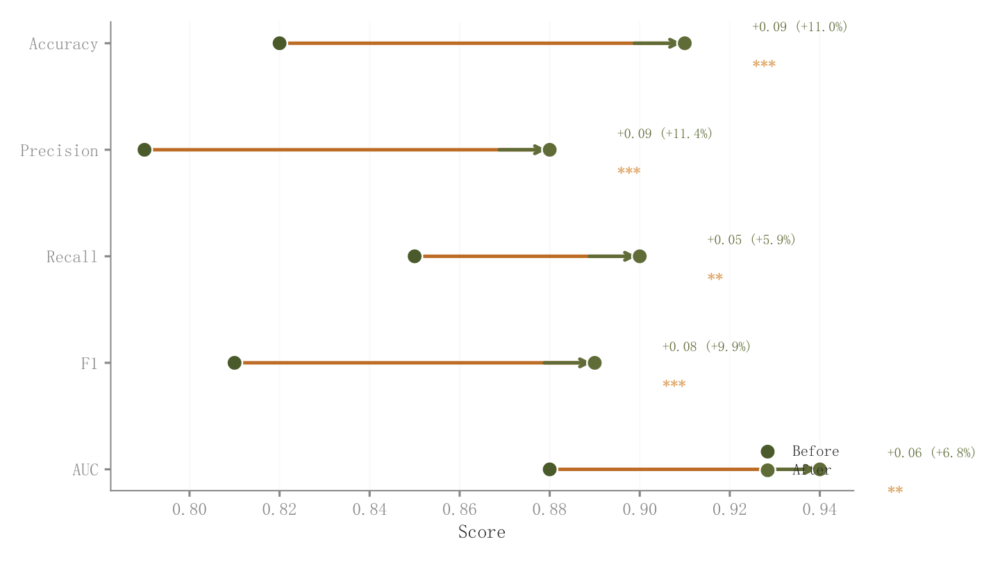

# 014 · 前后对比哑铃图

ID：`advanced.dumbbell`

用途：每个指标改善或下降了多少？

标签：比较、变化

别名：前后对比哑铃图

## 数据要求

- 各指标前后值
- 可选变化率与显著性结果

## 组合结构

每行两个端点；细连接线和箭头

## 视觉特点

- 两端对比色
- 右侧增量
- 简洁共享数轴

## 适配注意

这是汇总值对比，不显示个体配对分布；预览末行标签靠近右下图例。

## 预览

## 来源与核对

原名称：Dumbbell Chart — 哑铃图（连接线 + 变化率 + 显著性标记）
原始代码：[查看](../sources/advanced.dumbbell/original.html)
预览范围：首个主要Python示例
已查看对应预览并核对主要绘图和数据代码；卡片不是统计有效性认证。

## 相近候选

- [个体配对变化与均值箭头](advanced.paired_dot.md)
- [两阶段斜率与排名变化](advanced.slope.md)
- [多阶段名次轨迹](advanced.bump.md)

<!-- fidelity:start -->
## 源码保真要点

以当前完整配方源码为底稿；下列行号指向解释预览的快照。数据适配不应顺手删掉这些视觉结构。

### 两端点、连接与变化

- 保留重点：保留两端颜色区分、白边点、连接线及方向箭头；变化文字与两端同一数轴对齐。
- 可适配：对象数量、间距和标注偏移可调，正负方向和变化率按数据更新。
- 源码：[L24–25](../sources/advanced.dumbbell/original.html#L24) · [L27–28](../sources/advanced.dumbbell/original.html#L27) · [L31–32](../sources/advanced.dumbbell/original.html#L31) · [L33–34](../sources/advanced.dumbbell/original.html#L33)

按现有审图流程对照实际输出；有疑问时可用[源码差异提示](../../template-fidelity.md)。
