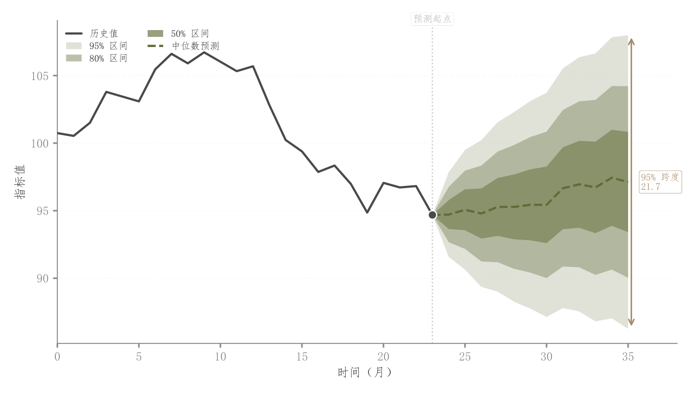

# 039 · 历史与预测分位数扇形图

ID：`advanced.fan`

用途：未来趋势及逐步扩大的不确定性怎样？

标签：预测、趋势、误差

别名：fan chart、预测区间、分位数带

## 数据要求

- 历史序列
- 未来中位数与多组分位数

## 组合结构

单面板；历史与预测分隔

## 视觉特点

- 三档嵌套透明区间
- 历史实线、预测虚线
- 终点范围

## 适配注意

分位数应有序且来源一致；示例扩散范围为模拟，不是已拟合预测器输出。

## 预览

## 来源与核对

原名称：Fan Chart — 预测扇形图（多层 CI 带 + 历史/预测分隔 + 中位数线）
原始代码：[查看](../sources/advanced.fan/original.html)
预览范围：首个主要Python示例
已查看对应预览并核对主要绘图和数据代码；卡片不是统计有效性认证。

## 相近候选

- [时序预测与误差侧分布](empirical.prediction_ci.md)
- [概率校准与预测概率分布](advanced.calibration.md)
- [预测对实际散点与下方残差分布](competition.prediction_actual.md)

<!-- fidelity:start -->
## 源码保真要点

以当前完整配方源码为底稿；下列行号指向解释预览的快照。数据适配不应顺手删掉这些视觉结构。

### 分位扇形的三档层次

- 保留重点：保留由浅到深的三档嵌套分位带、历史实线与预测虚线、历史末点与预测衔接，不改成单个误差带。
- 可适配：分位数、预测长度和分界随真实预测更新，不能套用折线图的透明度顺序或模拟宽度。
- 源码：[L26–26](../sources/advanced.fan/original.html#L26) · [L27–28](../sources/advanced.fan/original.html#L27) · [L37–39](../sources/advanced.fan/original.html#L37) · [L41–43](../sources/advanced.fan/original.html#L41) · [L45–47](../sources/advanced.fan/original.html#L45) · [L49–50](../sources/advanced.fan/original.html#L49)

按现有审图流程对照实际输出；有疑问时可用[源码差异提示](../../template-fidelity.md)。
