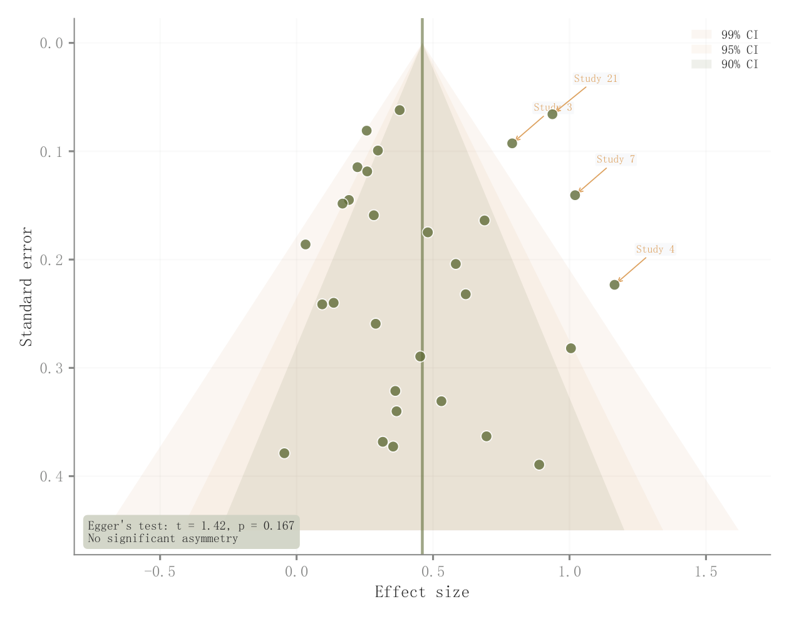

# 024 · Meta分析漏斗图

ID：`advanced.funnel`

用途：研究效应与精度关系是否呈不对称分布？

标签：误差、诊断

别名：Meta分析漏斗图

## 数据要求

- 每项研究的效应量和标准误
- 汇总效应

## 组合结构

效应量横轴；倒置标准误纵轴

## 视觉特点

- 90/95/99%嵌套漏斗区
- 汇总竖线
- 异常研究标签

## 适配注意

嵌套区是参考界限；Egger及汇总统计需用真实研究估计，不能只凭形状断言偏倚。

## 预览

## 来源与核对

原名称：Funnel Plot — 漏斗图（Meta 分析：渐变 CI 带 90/95/99% + 研究标签 + Egger 检验）
原始代码：[查看](../sources/advanced.funnel/original.html)
预览范围：首个主要Python示例
已查看对应预览并核对主要绘图和数据代码；卡片不是统计有效性认证。

<!-- fidelity:start -->
## 源码保真要点

以当前完整配方源码为底稿；下列行号指向解释预览的快照。数据适配不应顺手删掉这些视觉结构。

### 三档漏斗区而非单片三角

- 保留重点：保留 99/95/90% 的三档嵌套区与透明度对应关系、汇总竖线和倒置标准误轴；这里的层序不照搬折线图。
- 可适配：由效应与标准误计算边界和汇总量；色相可变，异常标注与检验结果须重算。
- 源码：[L29–32](../sources/advanced.funnel/original.html#L29) · [L35–35](../sources/advanced.funnel/original.html#L35) · [L38–39](../sources/advanced.funnel/original.html#L38)

按现有审图流程对照实际输出；有疑问时可用[源码差异提示](../../template-fidelity.md)。
