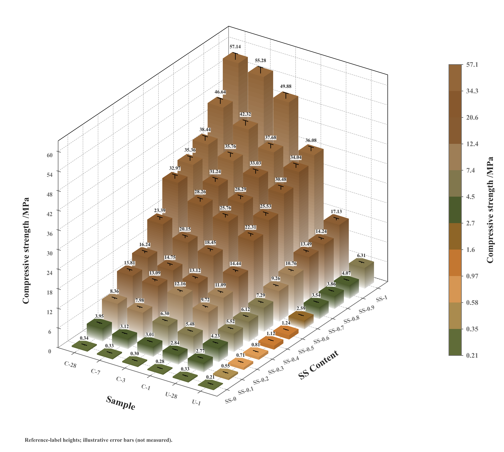

# 三维分组渐变柱状图

模板 142 · `advanced.grouped_bar_3d`

标签：三维、柱状、比较、误差

## 用途与数据

不同样品在多个实验条件下的测量值及不确定性如何变化？

- 行类别×列条件的非负有限数值矩阵
- 两轴标签；可选真实对称/非对称误差长度

## 结构与视觉特点

白到主题色的分层渐变柱面、顶面与侧面明暗、柱顶数值标签、可选误差棒、数值分档色条、正交视角和虚线网格

## 适配和来源

按用户参考图的既有复现源码适配。示例柱高为标签转录值，误差为示意并已标注；自定义数据不自动补误差。支持非负有限矩阵；三维遮挡较多时需控制组数。分档阈值可不等宽，色条等高块代表档位。

[完整代码](../sources/advanced.grouped_bar_3d/original.py) · [来源与调用](../sources/advanced.grouped_bar_3d/SOURCE.md) · [参考图](../sources/advanced.grouped_bar_3d/reference.jpg)

## 源码保真要点

保留四面渐变分层、独立顶面明暗、正交视角、逐柱数值、真实数据支持的误差棒与分段色条；柱体和色条必须共用同一分档及颜色映射。

可改行列数、数据、真实误差、标签、视角与分档阈值；换色保留白到主题色的柱面渐变，不把分类取色顺序当数值色阶。无真实误差时省略该层。

- 源码定位：[sources/advanced.grouped_bar_3d/original.html#L115](../sources/advanced.grouped_bar_3d/original.html#L115)
- 源码定位：[sources/advanced.grouped_bar_3d/original.html#L123](../sources/advanced.grouped_bar_3d/original.html#L123)
- 源码定位：[sources/advanced.grouped_bar_3d/original.html#L125](../sources/advanced.grouped_bar_3d/original.html#L125)
- 源码定位：[sources/advanced.grouped_bar_3d/original.html#L106](../sources/advanced.grouped_bar_3d/original.html#L106)
- 源码定位：[sources/advanced.grouped_bar_3d/original.html#L142](../sources/advanced.grouped_bar_3d/original.html#L142)
- 源码定位：[sources/advanced.grouped_bar_3d/original.html#L82](../sources/advanced.grouped_bar_3d/original.html#L82)

## 相近候选

- [二维分组柱](basic.grouped_bar.md)：较少遮挡，适合精确比较。
- [三维方柱曲面](screenshot.block_surface_3d.md)：密集网格标量场，不含此处的逐柱标签和误差层。
