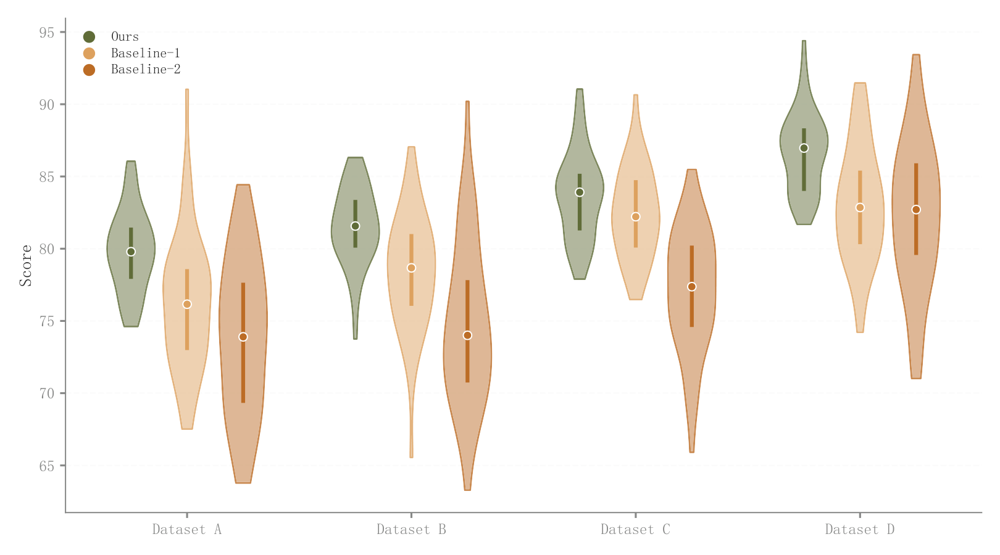

# 036 · 类别内多方法小提琴

ID：`advanced.grouped_violin`

用途：多个数据集内各方法的重复结果分布如何？

标签：分布、比较

别名：grouped violin、双因素分组分布

## 数据要求

- 外层类别×方法
- 每组合的原始样本

## 组合结构

每个类别内并排多把完整小提琴

## 视觉特点

- 浅色琴体
- 深轮廓
- 中位数和四分位线

## 适配注意

双重分组太多时拥挤；不能用单个平均值虚构密度。

## 预览

## 来源与核对

原名称：Grouped Violin Plot (Multi-Group Distribution Comparison + Median + Quartile Lines)
原始代码：[查看](../sources/advanced.grouped_violin/original.html)
预览范围：首个主要Python示例
已查看对应预览并核对主要绘图和数据代码；卡片不是统计有效性认证。

## 相近候选

- [竖向雨云分布组合](basic.raincloud.md)
- [完整小提琴与箱线显著性比较](basic.raincloud_violin.md)
- [堆叠山脊密度](advanced.ridgeline.md)
- [横向长尾分布雨云与分位标记](empirical.raincloud.md)
- [雨云分布与效应量显著性](academic.confusion_matrix.md)
- [模型误差横向雨云](empirical.prediction_error_raincloud.md)

<!-- fidelity:start -->
## 源码保真要点

以当前完整配方源码为底稿；下列行号指向解释预览的快照。数据适配不应顺手删掉这些视觉结构。

### 浅琴体和深描边是两个设置

- 保留重点：保留 _lighten 的填色处理、独立边线与 alpha=0.8 的琴体；不要把填充和轮廓同时设成同一实色。
- 可适配：色相跟随已选配色，组数、并排位置和宽度适配类别数量；浅深关系继续保留。
- 源码：[L25–38](../sources/advanced.grouped_violin/original.html#L25)

### 中位数与四分位线

- 保留重点：保留白边中位数点与较粗的 Q1–Q3 竖线，不把统计层简化成无内部信息的琴体。
- 可适配：分位数来自每组有效原始样本；布局和线长随数据变化，不复制示例数值。
- 源码：[L40–50](../sources/advanced.grouped_violin/original.html#L40)

按现有审图流程对照实际输出；有疑问时可用[源码差异提示](../../template-fidelity.md)。
