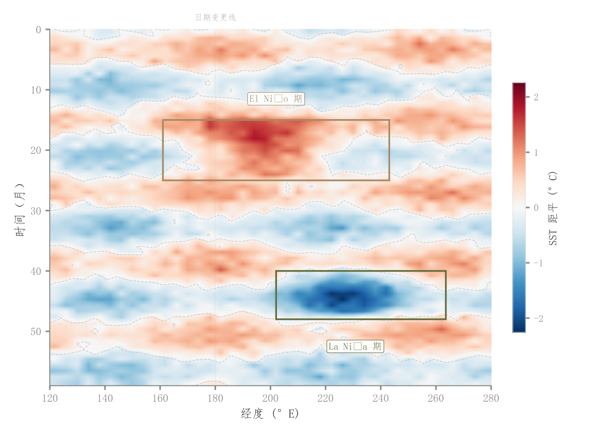

# 041 · Hovmöller时空异常图

ID：`advanced.hovmoller`

用途：空间异常怎样随时间传播和持续？

标签：空间、时间、矩阵

别名：Hovmöller时空异常图

## 数据要求

- 时间×空间坐标的数值矩阵
- 异常基准

## 组合结构

时间纵轴、空间横轴；侧色条

## 视觉特点

- 红蓝异常色阶
- 等值线
- 事件框

## 适配注意

适合有序空间轴而非任意类别；以零为中心的含义需成立；事件框为示例。

## 预览

## 来源与核对

原名称：Hovmöller — 时空双轴图（时间纵 + 空间横 + 偏离均值色阶 + 事件标注）
原始代码：[查看](../sources/advanced.hovmoller/original.html)
预览范围：首个主要Python示例
已查看对应预览并核对主要绘图和数据代码；卡片不是统计有效性认证。

<!-- fidelity:start -->
## 源码保真要点

以当前完整配方源码为底稿；下列行号指向解释预览的快照。数据适配不应顺手删掉这些视觉结构。

### 异常色阶和零等值线

- 保留重点：保留时间—空间坐标、以零为中心的正负异常色阶、零等值线与有依据的事件框。
- 可适配：时间范围、空间方向、连续色相和显示分辨率可变，不因美化颠倒时间或抹去正负含义。
- 源码：[L25–27](../sources/advanced.hovmoller/original.html#L25) · [L30–31](../sources/advanced.hovmoller/original.html#L30) · [L35–37](../sources/advanced.hovmoller/original.html#L35) · [L43–45](../sources/advanced.hovmoller/original.html#L43)

按现有审图流程对照实际输出；有疑问时可用[源码差异提示](../../template-fidelity.md)。
