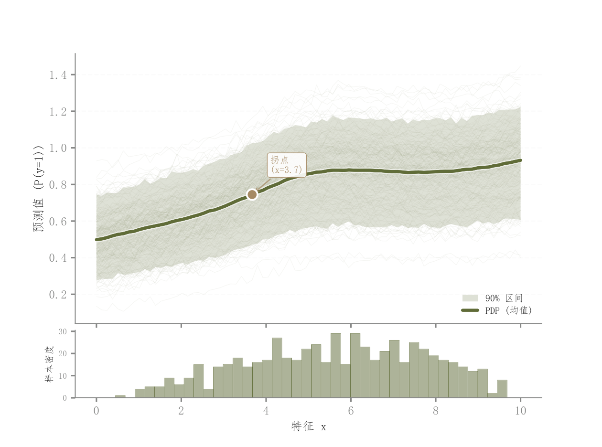

# 038 · ICE个体响应与PDP组合

ID：`advanced.ice_pdp`

用途：特征变化如何影响个体及平均预测？

标签：解释、趋势、分布、组合

别名：ICE、PDP、partial dependence、个体条件期望

## 数据要求

- 特征网格
- 每个样本的模型响应
- 真实特征样本

## 组合结构

上方ICE细线与PDP；下方特征直方图

## 视觉特点

- 低透明度曲线群形成密度感
- 粗均值线
- 单层分位范围
- 拐点标注

## 适配注意

示例响应是模拟函数；个体差异带不等同均值置信区间；相关特征下需注意干预解释。

## 预览

## 来源与核对

原名称：ICE + PDP — 可解释机器学习（多条 ICE 细线 + 粗 PDP 均值线 + 边际分布）
原始代码：[查看](../sources/advanced.ice_pdp/original.html)
预览范围：首个主要Python示例
已查看对应预览并核对主要绘图和数据代码；卡片不是统计有效性认证。

<!-- fidelity:start -->
## 源码保真要点

以当前完整配方源码为底稿；下列行号指向解释预览的快照。数据适配不应顺手删掉这些视觉结构。

### 细曲线群与白色衬边主线

- 保留重点：保留低 alpha 的 ICE 曲线群、浅色单层分位范围和带白色衬边的粗 PDP 均值线，以及下方特征直方图。源码没有额外 rug 或多层区间。
- 可适配：样本数、特征网格与直方分箱可变；该范围来自个体曲线分位数，不自动称为 PDP 估计置信区间。
- 源码：[L35–35](../sources/advanced.ice_pdp/original.html#L35) · [L38–39](../sources/advanced.ice_pdp/original.html#L38) · [L42–42](../sources/advanced.ice_pdp/original.html#L42) · [L44–44](../sources/advanced.ice_pdp/original.html#L44) · [L45–45](../sources/advanced.ice_pdp/original.html#L45) · [L67–68](../sources/advanced.ice_pdp/original.html#L67)

按现有审图流程对照实际输出；有疑问时可用[源码差异提示](../../template-fidelity.md)。
