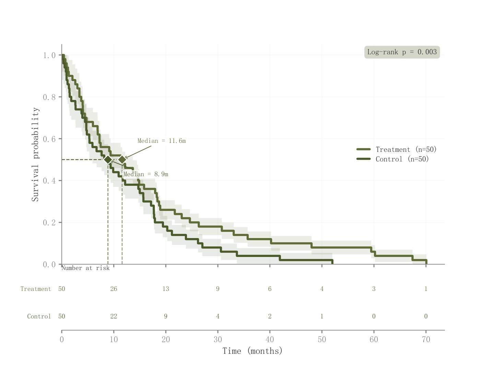

# 021 · 生存阶梯与风险人数表

ID：`advanced.kaplan_meier`

用途：分组生存概率和在险人数如何随时间变化？

标签：生存、趋势、组合

别名：Kaplan Meier、KM、生存分析

## 数据要求

- 实际应用需生存时间、事件/删失状态与分组

## 组合结构

上方阶梯曲线及区间；下方风险表

## 视觉特点

- 阶梯细线
- 透明区间
- 中位生存期引线

## 适配注意

示例为无删失时间的演示曲线，CI及log-rank标注含示意成分；不能替代正式生存估计。

## 预览

## 来源与核对

原名称：Kaplan-Meier Survival Curve — 生存曲线（CI 带 + 中位数标记 + 风险人数表 + Log-Rank p）
原始代码：[查看](../sources/advanced.kaplan_meier/original.html)
预览范围：首个主要Python示例
已查看对应预览并核对主要绘图和数据代码；卡片不是统计有效性认证。

<!-- fidelity:start -->
## 源码保真要点

以当前完整配方源码为底稿；下列行号指向解释预览的快照。数据适配不应顺手删掉这些视觉结构。

### 阶梯、透明区间与风险表

- 保留重点：保留阶梯曲线与 step=post 的区间形状、下方风险表及可用的中位生存期引线，不平滑成连续曲线。
- 可适配：按实际时间、事件和删失计算生存率、区间及风险人数；未达到中位生存期时不造交点。
- 源码：[L34–34](../sources/advanced.kaplan_meier/original.html#L34) · [L38–38](../sources/advanced.kaplan_meier/original.html#L38) · [L42–42](../sources/advanced.kaplan_meier/original.html#L42) · [L45–45](../sources/advanced.kaplan_meier/original.html#L45)

按现有审图流程对照实际输出；有疑问时可用[源码差异提示](../../template-fidelity.md)。
