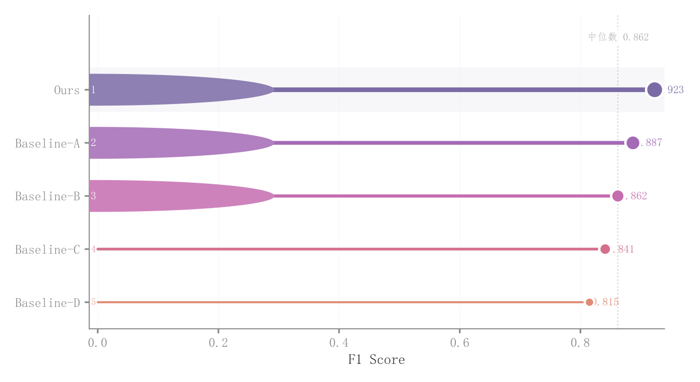

# 013 · 排名棒棒糖与徽章

ID：`advanced.lollipop`

用途：少量方法得分如何排序并突出领先者？

标签：排序、比较

别名：lollipop、横向排名

## 数据要求

- 类别名称与单项得分

## 组合结构

横向棒棒糖；左端排名徽章

## 视觉特点

- 类别间紫到珊瑚色过渡
- 线宽和点大小映射分数
- 中位线

## 适配注意

单根线和点内部不是渐变；前三名圆徽章使用数据坐标，预览呈横向拉伸；不预判此设计必须修正。

## 预览

## 来源与核对

原名称：Lollipop Chart — 棒棒糖图（渐变色茎 + 排名徽章 + 中位数参考线）
原始代码：[查看](../sources/advanced.lollipop/original.html)
预览范围：首个主要Python示例
已查看对应预览并核对主要绘图和数据代码；卡片不是统计有效性认证。

预览执行兼容调整：RGB 元组转十六进制以适配原 _lighten 接口，颜色含义不变

<!-- fidelity:start -->
## 源码保真要点

以当前完整配方源码为底稿；下列行号指向解释预览的快照。数据适配不应顺手删掉这些视觉结构。

### 排名徽章与强度映射

- 保留重点：保留颜色随排名过渡、线宽和点面积随分数变化、白边端点与排名徽章；不要变成同宽同色的普通棒棒糖。
- 可适配：得分、名次及徽章数量据实更新，色相可替换但保留过渡；长名称可增加左边距。
- 源码：[L46–46](../sources/advanced.lollipop/original.html#L46) · [L55–56](../sources/advanced.lollipop/original.html#L55) · [L60–61](../sources/advanced.lollipop/original.html#L60) · [L75–75](../sources/advanced.lollipop/original.html#L75)

按现有审图流程对照实际输出；有疑问时可用[源码差异提示](../../template-fidelity.md)。
