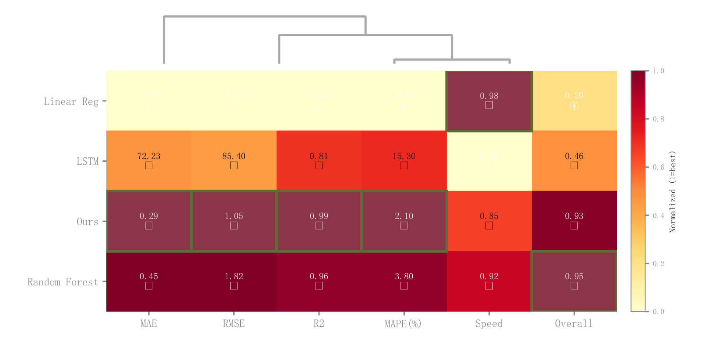

# 028 · 多指标方法排名热力图

ID：`advanced.method_heatmap`

用途：混合优劣方向的指标下，方法整体表现怎样？

标签：比较、排序、矩阵

别名：多指标方法排名热力图

## 数据要求

- 方法×指标原值
- 每项高优或低优方向

## 组合结构

指标列与综合列；方法行；顶部聚类树

## 视觉特点

- 格内原值和名次
- 列最优边框
- 综合分

## 适配注意

需要正确归一化和方向；奖牌字形可能缺失，浅黄格白字偏淡；树状图与矩阵排序应核对。

## 预览

## 来源与核对

原名称：Method Comparison Heatmap — 方法对比热力图（排名标注 🥇🥈🥉 + 树状图 + 列最优高亮 + 综合排名）
原始代码：[查看](../sources/advanced.method_heatmap/original.html)
预览范围：首个主要Python示例
已查看对应预览并核对主要绘图和数据代码；卡片不是统计有效性认证。

## 相近候选

- [归一化多指标雷达对比](academic.latent_interpolation.md)
- [多方案雷达与交替背景环](competition.radar.md)
- [多指标平行坐标](advanced.parallel_coordinates.md)
- [多模型多指标预测热力排名](empirical.prediction_accuracy_heatmap.md)

<!-- fidelity:start -->
## 源码保真要点

以当前完整配方源码为底稿；下列行号指向解释预览的快照。数据适配不应顺手删掉这些视觉结构。

### 格内原值与列最优框

- 保留重点：保留按列归一化着色、格内原值/名次、列最优边框和综合列，着色与显示数值分开。
- 可适配：指标数量、优劣方向、综合权重和聚类次序按任务更新，不将不同量纲直接平均。
- 源码：[L55–55](../sources/advanced.method_heatmap/original.html#L55) · [L86–87](../sources/advanced.method_heatmap/original.html#L86) · [L91–94](../sources/advanced.method_heatmap/original.html#L91) · [L97–99](../sources/advanced.method_heatmap/original.html#L97)

按现有审图流程对照实际输出；有疑问时可用[源码差异提示](../../template-fidelity.md)。
