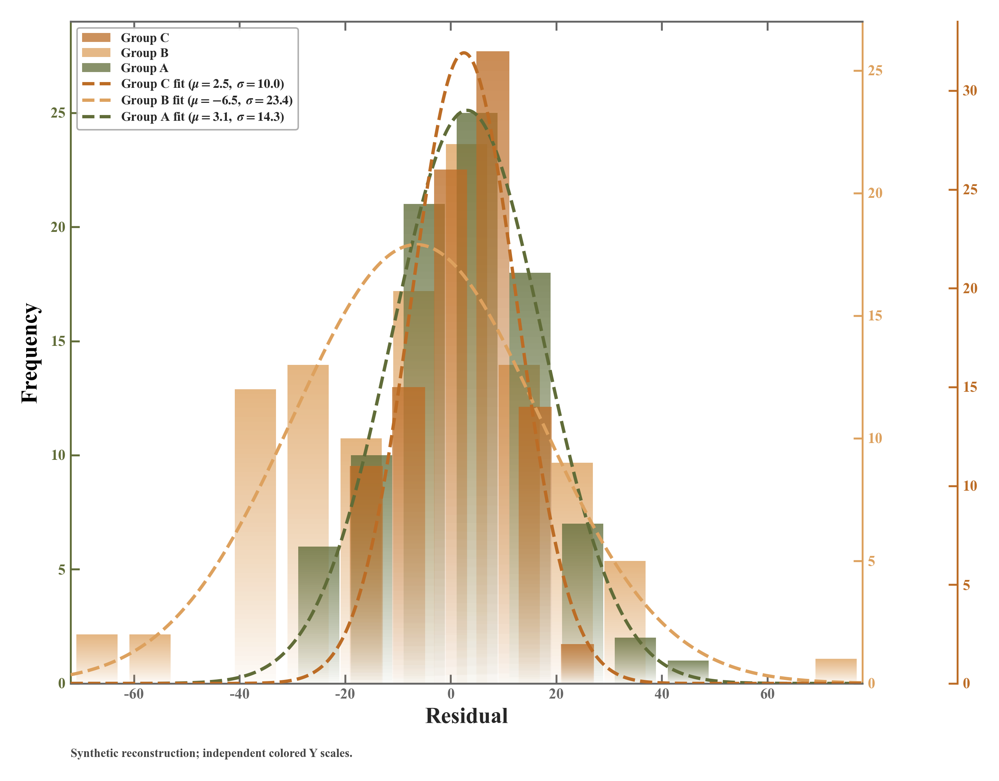

# 多Y轴渐变直方图与正态拟合

模板143 · `advanced.multi_y_gradient_hist`

标签：分布、比较、多轴、渐变

## 用途与数据

多个群体在同一测量变量上的中心、离散程度和分布形状有何区别？

- 1–3组同单位原始观测及组名
- 每组至少两个等宽箱，可采用错位分箱；可选正态拟合

## 结构与视觉特点

透明到原色的柱体渐变、组间错位等宽分箱、三组重叠直方图、左1右2同色独立Y轴、正态拟合虚线、样本量与拟合参数图例

## 适配和来源

仅效果图重建，未提供原代码或样本；预览为固定种子模拟数据。独立Y轴只能按对应颜色刻度读数，不能直接跨组比柱高；正态拟合可关闭，不代表正态性通过。

[完整代码](../sources/advanced.multi_y_gradient_hist/original.py) · [来源与调用](../sources/advanced.multi_y_gradient_hist/SOURCE.md) · [参考截图](../sources/advanced.multi_y_gradient_hist/reference.jpg)

## 源码保真要点

保留柱体真实透明渐变、叠加关系、共享横轴与独立同色Y轴、图例和虚线拟合；每组图层绑定自身Y轴变换，拟合按该组N×该组箱宽换算到频数。

可以更换样本、分箱数、配色、标签和不截断的刻度范围；缺少正态假设或零方差时关闭拟合。不能把渐变改成纯色，不能用独立轴柱高声称频数更大。

- 源码定位：[sources/advanced.multi_y_gradient_hist/original.html#L154](../sources/advanced.multi_y_gradient_hist/original.html#L154)
- 源码定位：[sources/advanced.multi_y_gradient_hist/original.html#L160](../sources/advanced.multi_y_gradient_hist/original.html#L160)
- 源码定位：[sources/advanced.multi_y_gradient_hist/original.html#L153](../sources/advanced.multi_y_gradient_hist/original.html#L153)
- 源码定位：[sources/advanced.multi_y_gradient_hist/original.html#L118](../sources/advanced.multi_y_gradient_hist/original.html#L118)
- 源码定位：[sources/advanced.multi_y_gradient_hist/original.html#L130](../sources/advanced.multi_y_gradient_hist/original.html#L130)
- 源码定位：[sources/advanced.multi_y_gradient_hist/original.html#L140](../sources/advanced.multi_y_gradient_hist/original.html#L140)
