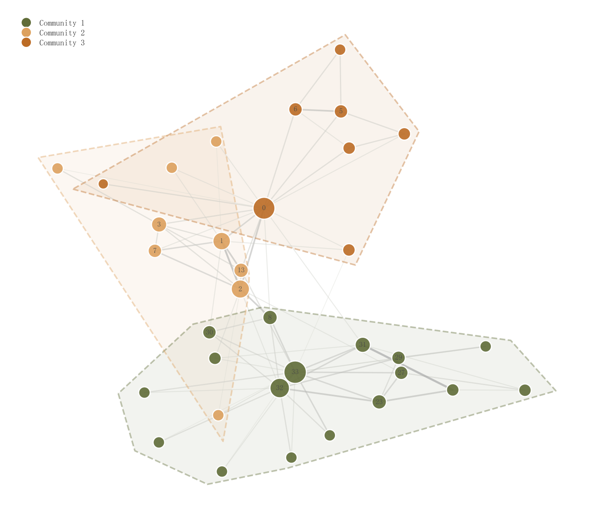

# 027 · 社区网络与透明凸包

ID：`advanced.network`

用途：网络社区、枢纽和连接强度怎样分布？

标签：网络、聚类

别名：社区网络与透明凸包

## 数据要求

- 节点、边与权重
- 可计算社区和度

## 组合结构

力导向节点连线；社区外围多边形

## 视觉特点

- 透明社区凸包
- 节点大小映射度
- 边色和宽度映射权重

## 适配注意

布局距离并非地理距离；单条边内部不是渐变；凸包是展示包络而非统计置信域。

## 预览

## 来源与核对

原名称：Network Graph — 网络图（节点大小映射度 + 社区凸包 + 边权渐变）
原始代码：[查看](../sources/advanced.network/original.html)
预览范围：首个主要Python示例
已查看对应预览并核对主要绘图和数据代码；卡片不是统计有效性认证。

预览执行兼容调整：保留节点 artist 以设置绘制层级；NetworkX 不接受 zorder 参数，改为在返回对象上设置同值

<!-- fidelity:start -->
## 源码保真要点

以当前完整配方源码为底稿；下列行号指向解释预览的快照。数据适配不应顺手删掉这些视觉结构。

### 社区浅包络与加权连边

- 保留重点：保留社区透明凸包及虚线边缘、节点大小映射度、边宽和透明度映射权重，不能统一成同色同宽网络。
- 可适配：按实际网络重算社区和布局；小社区或退化凸包可省包络并说明，接口兼容修改不改变视觉目的。
- 源码：[L46–47](../sources/advanced.network/original.html#L46) · [L48–50](../sources/advanced.network/original.html#L48) · [L63–64](../sources/advanced.network/original.html#L63) · [L67–68](../sources/advanced.network/original.html#L67)

按现有审图流程对照实际输出；有疑问时可用[源码差异提示](../../template-fidelity.md)。
