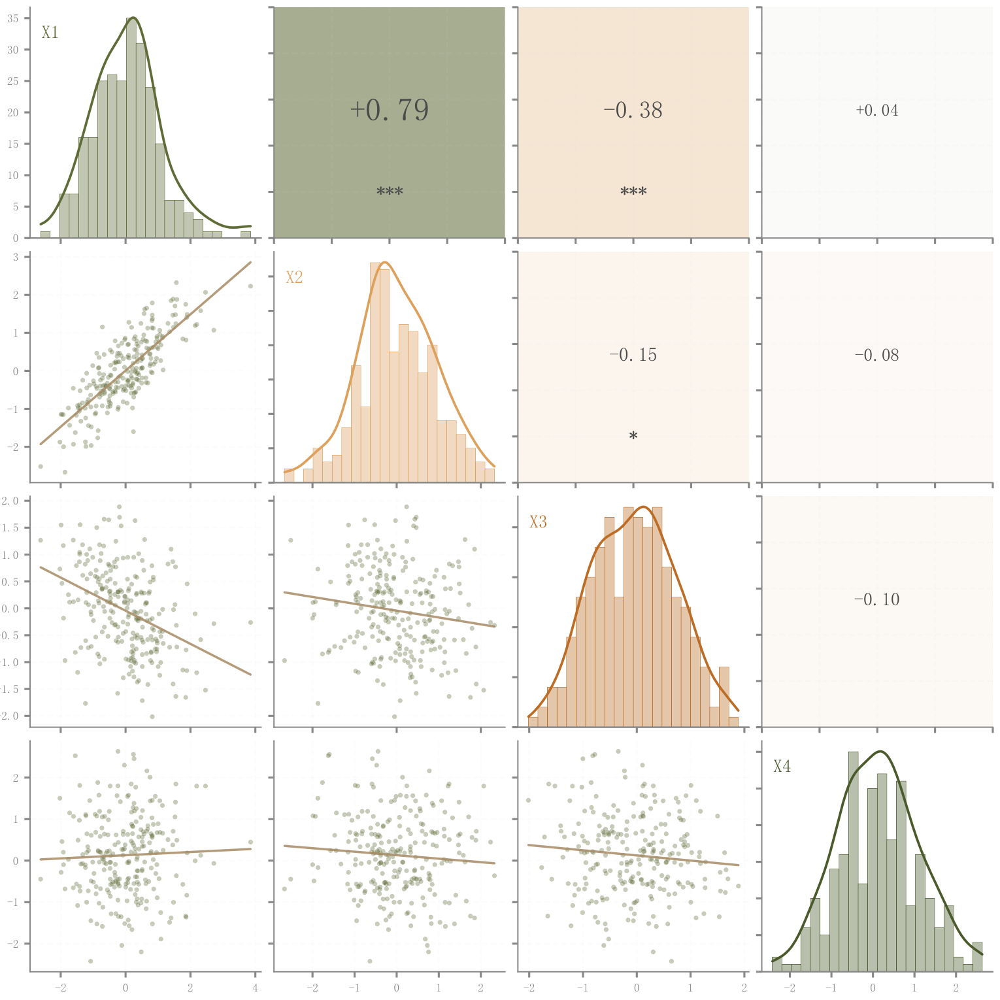

# 042 · 分布与Pearson成对关系矩阵

ID：`advanced.pair_plot`

用途：多个变量各自怎样分布、两两怎样相关？

标签：关联、分布、多维、组合

别名：pair plot、pairplot、pairgrid、scatter matrix、散点矩阵、Pearson、分布与相关关系、成对关系、问卷变量关系

## 数据要求

- 样本×连续变量矩阵
- 变量名

## 组合结构

N×N矩阵：对角直方图与KDE，下三角散点回归，上三角相关系数

## 视觉特点

- 正负相关背景色
- 字号随强度
- 显著性星号
- 边缘共用标签

## 适配注意

需要原始样本才能同时画密度和散点；变量过多时矩阵增长很快；不同于左侧另加残差小提琴的完整组合。

## 预览

## 来源与核对

原名称：Pair Plot / Scatter Matrix — 配对图（对角线 KDE + 上三角相关系数 + 下三角散点拟合）
原始代码：[查看](../sources/advanced.pair_plot/original.html)
预览范围：首个主要Python示例
已查看对应预览并核对主要绘图和数据代码；卡片不是统计有效性认证。

## 相近候选

- [残差小提琴与Pearson完整组合](template.sem_violin_pearson.md)
- [相关显著性热图与顶部树](empirical.correlation_heatmap.md)
- [简洁下三角相关矩阵](competition.correlation_matrix.md)
- [带双侧树状图的下三角相关矩阵](basic.heatmap.md)

<!-- fidelity:start -->
## 源码保真要点

以当前完整配方源码为底稿；下列行号指向解释预览的快照。数据适配不应顺手删掉这些视觉结构。

### 三角分工的成对矩阵

- 保留重点：保留对角分布与 KDE、下三角透明散点和回归、上三角相关数值/背景及边缘标签；三部分分工不可压成重复散点。
- 可适配：变量数、样本与标签可变；相关、星号、回归和密度均重新计算，退化变量按数据处理。
- 源码：[L26–27](../sources/advanced.pair_plot/original.html#L26) · [L30–31](../sources/advanced.pair_plot/original.html#L30) · [L36–38](../sources/advanced.pair_plot/original.html#L36) · [L41–42](../sources/advanced.pair_plot/original.html#L41) · [L47–48](../sources/advanced.pair_plot/original.html#L47) · [L57–57](../sources/advanced.pair_plot/original.html#L57) · [L60–62](../sources/advanced.pair_plot/original.html#L60) · [L64–65](../sources/advanced.pair_plot/original.html#L64)

按现有审图流程对照实际输出；有疑问时可用[源码差异提示](../../template-fidelity.md)。
