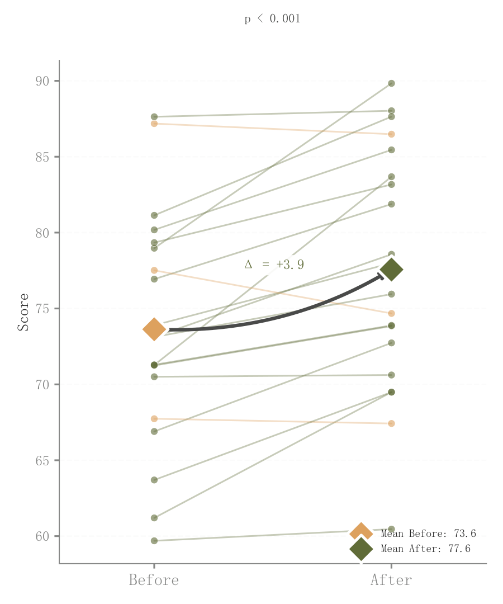

# 034 · 个体配对变化与均值箭头

ID：`advanced.paired_dot`

用途：同一批个体前后分别改变了多少？

标签：比较、变化、分布

别名：个体配对变化与均值箭头

## 数据要求

- 个体ID对应的前后两次测量

## 组合结构

两列个体散点逐一连接；均值菱形

## 视觉特点

- 细透明个体线
- 粗均值连线
- 变化箭头

## 适配注意

需要真实配对关系；不能把独立两组样本按行连线；示例显著性文字需替换真实检验。

## 预览

## 来源与核对

原名称：Paired Dot Plot — 配对点图（个体变化连线 + 均值偏移箭头 + 显著性）
原始代码：[查看](../sources/advanced.paired_dot/original.html)
预览范围：首个主要Python示例
已查看对应预览并核对主要绘图和数据代码；卡片不是统计有效性认证。

## 相近候选

- [前后对比哑铃图](advanced.dumbbell.md)
- [两阶段斜率与排名变化](advanced.slope.md)
- [多阶段名次轨迹](advanced.bump.md)

<!-- fidelity:start -->
## 源码保真要点

以当前完整配方源码为底稿；下列行号指向解释预览的快照。数据适配不应顺手删掉这些视觉结构。

### 个体细线和均值强调

- 保留重点：保留逐个体半透明细连线、配对端点和均值菱形/变化箭头，区分个体变化与总体变化。
- 可适配：按实际个体 ID 配对，样本密度与避让可调；没有配对关系时不连接。
- 源码：[L17–18](../sources/advanced.paired_dot/original.html#L17) · [L19–20](../sources/advanced.paired_dot/original.html#L19) · [L24–25](../sources/advanced.paired_dot/original.html#L24) · [L26–27](../sources/advanced.paired_dot/original.html#L26) · [L30–32](../sources/advanced.paired_dot/original.html#L30)

按现有审图流程对照实际输出；有疑问时可用[源码差异提示](../../template-fidelity.md)。
