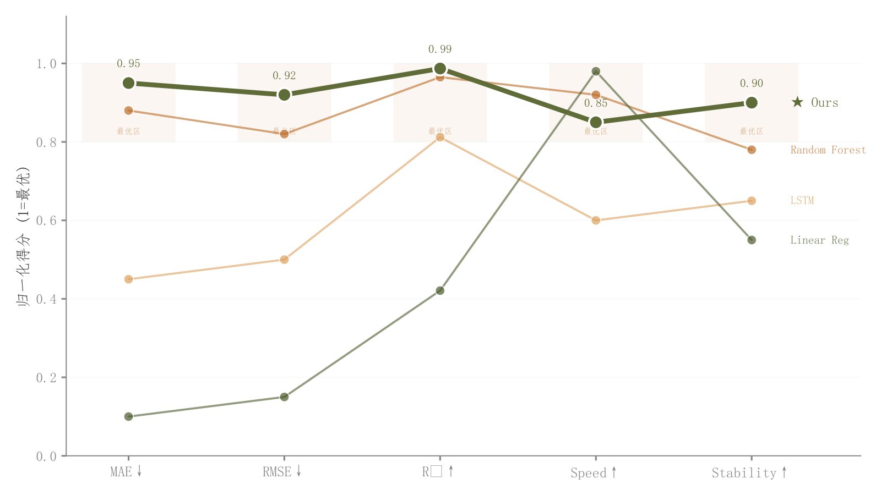

# 029 · 多指标平行坐标

ID：`advanced.parallel_coordinates`

用途：不同方法在哪些指标上互有优势？

标签：比较、多维

别名：多指标平行坐标

## 数据要求

- 方法×指标矩阵
- 统一到可比方向与范围

## 组合结构

并排竖轴；方法折线贯穿各维度

## 视觉特点

- 主方法加粗
- 顶部优势区域浅阴影

## 适配注意

高低方向必须统一；不同量纲原值不能直接共轴；阴影是优势区域而非CI。

## 预览

## 来源与核对

原名称：Parallel Coordinates — 平行坐标图（实线 + "本文"高亮 + 最优区域阴影）
原始代码：[查看](../sources/advanced.parallel_coordinates/original.html)
预览范围：首个主要Python示例
已查看对应预览并核对主要绘图和数据代码；卡片不是统计有效性认证。

## 相近候选

- [归一化多指标雷达对比](academic.latent_interpolation.md)
- [多方案雷达与交替背景环](competition.radar.md)
- [多指标方法排名热力图](advanced.method_heatmap.md)
- [多模型多指标预测热力排名](empirical.prediction_accuracy_heatmap.md)

<!-- fidelity:start -->
## 源码保真要点

以当前完整配方源码为底稿；下列行号指向解释预览的快照。数据适配不应顺手删掉这些视觉结构。

### 多维主次路径

- 保留重点：保留主路径粗线和白边大点、其他路径较浅较细以及有含义的优势区浅底。
- 可适配：维度和轴顺序可变；各维归一化与优劣方向必须一致，主方法由任务确定。
- 源码：[L25–26](../sources/advanced.parallel_coordinates/original.html#L25) · [L36–37](../sources/advanced.parallel_coordinates/original.html#L36) · [L39–40](../sources/advanced.parallel_coordinates/original.html#L39) · [L50–51](../sources/advanced.parallel_coordinates/original.html#L50) · [L52–53](../sources/advanced.parallel_coordinates/original.html#L52)

按现有审图流程对照实际输出；有疑问时可用[源码差异提示](../../template-fidelity.md)。
