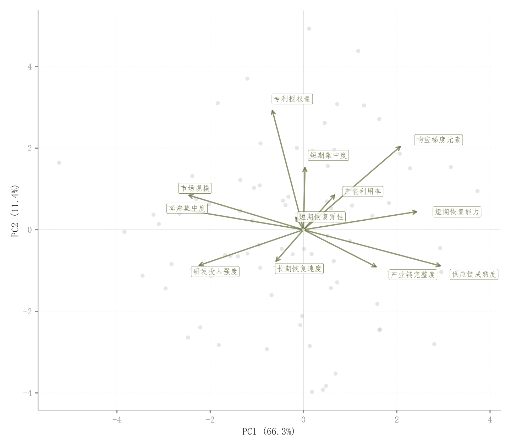

# 030 · PCA样本得分与载荷双标图

ID：`advanced.pca_biplot`

用途：样本结构与变量贡献方向怎样对应？

标签：多维、关联、降维

别名：PCA样本得分与载荷双标图

## 数据要求

- 前两主成分样本得分
- 载荷
- 解释方差

## 组合结构

样本散点叠加载荷箭头

## 视觉特点

- 浅灰样本
- 原点十字
- 箭头端变量名

## 适配注意

示例得分和载荷为模拟，未运行PCA；载荷与得分缩放需一致；原点附近标签偏密。

## 预览

## 来源与核对

原名称：PCA Biplot — PCA 双标图（载荷箭头 + 智能标签 + 解释方差）
原始代码：[查看](../sources/advanced.pca_biplot/original.html)
预览范围：首个主要Python示例
已查看对应预览并核对主要绘图和数据代码；卡片不是统计有效性认证。

预览执行兼容调整：补充代码使用但漏导入的 COLORS

<!-- fidelity:start -->
## 源码保真要点

以当前完整配方源码为底稿；下列行号指向解释预览的快照。数据适配不应顺手删掉这些视觉结构。

### 浅样本点与载荷箭头

- 保留重点：保留浅灰样本层、原点十字、载荷箭头与端点变量标签，不只画二维点云。
- 可适配：PCA 得分、载荷、解释方差和显示缩放由实际分析确定，标签可以避让。
- 源码：[L23–24](../sources/advanced.pca_biplot/original.html#L23) · [L48–48](../sources/advanced.pca_biplot/original.html#L48) · [L49–49](../sources/advanced.pca_biplot/original.html#L49)

按现有审图流程对照实际输出；有疑问时可用[源码差异提示](../../template-fidelity.md)。
