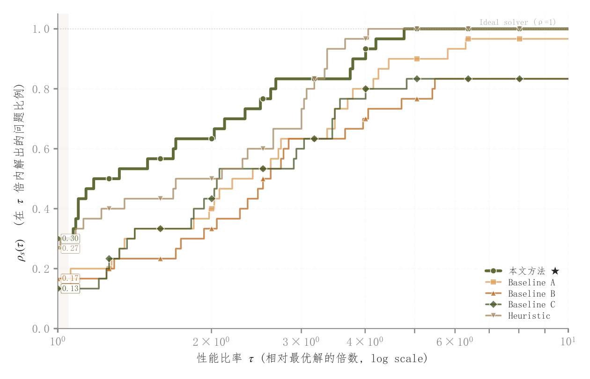

# 037 · Dolan–Moré性能剖面

ID：`advanced.performance_profile`

用途：算法跨多个问题的胜率与稳健性怎样？

标签：比较、排序、优化

别名：Dolan More、求解器基准、性能比累计分布

## 数据要求

- 问题×算法的正耗时或成本矩阵
- 失败状态

## 组合结构

对数性能比横轴；累计问题占比阶梯

## 视觉特点

- 不同点形和线型
- 主算法突出
- τ=1胜率标注

## 适配注意

比较的是相对每题最佳成本；零成本、失败和超时需明确处理；不是单问题收敛曲线。

## 预览

## 来源与核对

原名称：Performance Profile (Dolan-Moré) — 性能剖面图（多算法跨问题对比标准画法）
原始代码：[查看](../sources/advanced.performance_profile/original.html)
预览范围：首个主要Python示例
已查看对应预览并核对主要绘图和数据代码；卡片不是统计有效性认证。

## 相近候选

- [多算法迭代收敛曲线](competition.convergence.md)
- [损失准确率双轴与学习率插图](academic.training_curves.md)

<!-- fidelity:start -->
## 源码保真要点

以当前完整配方源码为底稿；下列行号指向解释预览的快照。数据适配不应顺手删掉这些视觉结构。

### 性能比的累计阶梯

- 保留重点：保留累计比例阶梯、对数性能比轴及方法线型/点形主次，不用平滑曲线替换经验阶梯。
- 可适配：求解器、问题集和失败处理按实际计算，τ=1 胜率标注重算。
- 源码：[L37–42](../sources/advanced.performance_profile/original.html#L37) · [L48–51](../sources/advanced.performance_profile/original.html#L48) · [L55–56](../sources/advanced.performance_profile/original.html#L55)

按现有审图流程对照实际输出；有疑问时可用[源码差异提示](../../template-fidelity.md)。
