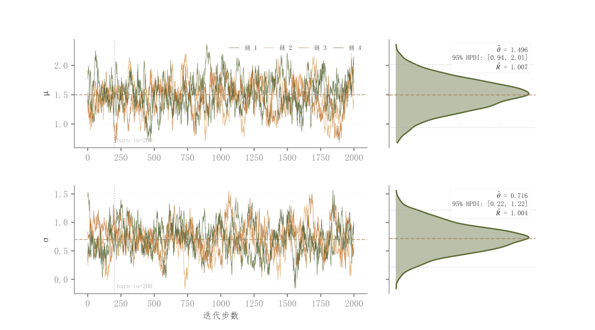

# 044 · MCMC轨迹与后验密度

ID：`advanced.posterior_trace_density`

用途：各链是否混合，参数后验集中在哪里？

标签：诊断、分布、组合

别名：MCMC、posterior、trace、后验诊断

## 数据要求

- 参数×链×迭代样本
- burn-in设置

## 组合结构

每参数一行；左轨迹、右侧竖向密度，共享参数轴

## 视觉特点

- 多条细链
- burn-in竖线
- 浅密度填充
- 区间统计框

## 适配注意

示例R-hat随机模拟；标注HPDI实际用等尾百分位区间；不能直接当作真实收敛诊断。

## 预览

## 来源与核对

原名称：Posterior Trace + Density — 贝叶斯 MCMC 双面板（多链 trace + 边际密度 + Rhat 标注）
原始代码：[查看](../sources/advanced.posterior_trace_density/original.html)
预览范围：首个主要Python示例
已查看对应预览并核对主要绘图和数据代码；卡片不是统计有效性认证。

<!-- fidelity:start -->
## 源码保真要点

以当前完整配方源码为底稿；下列行号指向解释预览的快照。数据适配不应顺手删掉这些视觉结构。

### 轨迹与竖向密度对齐

- 保留重点：保留每参数左侧多链细轨迹、右侧浅密度和深轮廓，共享参数值轴与 burn-in 标记。
- 可适配：链数、迭代数、舍弃区间与参数行数可变；后验摘要由保留样本计算，不由轨迹外观臆断收敛。
- 源码：[L32–34](../sources/advanced.posterior_trace_density/original.html#L32) · [L35–35](../sources/advanced.posterior_trace_density/original.html#L35) · [L53–54](../sources/advanced.posterior_trace_density/original.html#L53) · [L55–55](../sources/advanced.posterior_trace_density/original.html#L55)

按现有审图流程对照实际输出；有疑问时可用[源码差异提示](../../template-fidelity.md)。
