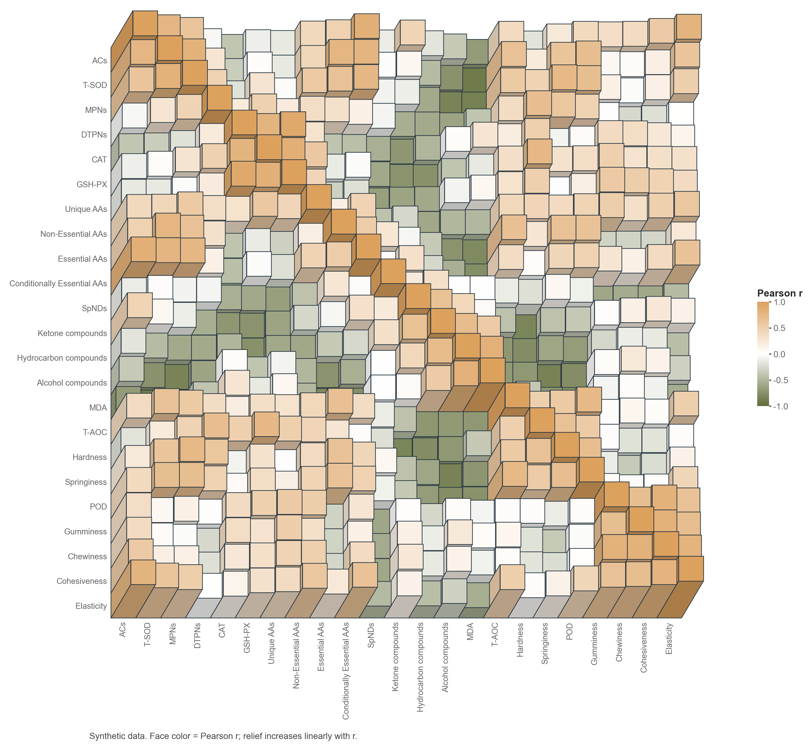

# 立体方块相关性热图

模板144 · `advanced.relief_correlation_heatmap`

标签：三维、矩阵、相关、浮雕

## 用途与数据

多变量之间有哪些正负相关结构与关联强弱差异？

- 完整观测数值表，或有效对称Pearson相关矩阵
- 2–40个变量及唯一行列标签

## 结构与视觉特点

正方形矩阵正面、错落浮雕高度、双侧阴影与细棱线、矩阵行列标签、有符号相关性色条

## 适配和来源

仅效果图重建；演示相关矩阵来自模拟样本。颜色表示Pearson r，高度按r线性增加，这是明确约定而非原图已知规则；侧壁阴影不能代替正面读色。

[完整源码](../sources/advanced.relief_correlation_heatmap/original.py) · [来源与编码](../sources/advanced.relief_correlation_heatmap/SOURCE.md) · [参考图](../sources/advanced.relief_correlation_heatmap/reference.jpg)

## 源码保真要点

保留完整矩阵、固定斜投影的方形正面、双侧阴影、细棱线及后到前绘制顺序；正面色与色条严格共用[-1,1]映射，凸起按有符号r的声明公式计算。

可替换有效相关矩阵、标签、配色与凸起强度；颜色不受阴影或relief参数重新归一化。保留正负语义，不凭视觉推定缺失数据，不将方块平滑成连续曲面。

- 源码定位：[sources/advanced.relief_correlation_heatmap/original.html#L90](../sources/advanced.relief_correlation_heatmap/original.html#L90)
- 源码定位：[sources/advanced.relief_correlation_heatmap/original.html#L92](../sources/advanced.relief_correlation_heatmap/original.html#L92)
- 源码定位：[sources/advanced.relief_correlation_heatmap/original.html#L105](../sources/advanced.relief_correlation_heatmap/original.html#L105)
- 源码定位：[sources/advanced.relief_correlation_heatmap/original.html#L60](../sources/advanced.relief_correlation_heatmap/original.html#L60)
- 源码定位：[sources/advanced.relief_correlation_heatmap/original.html#L61](../sources/advanced.relief_correlation_heatmap/original.html#L61)
- 源码定位：[sources/advanced.relief_correlation_heatmap/original.html#L85](../sources/advanced.relief_correlation_heatmap/original.html#L85)
