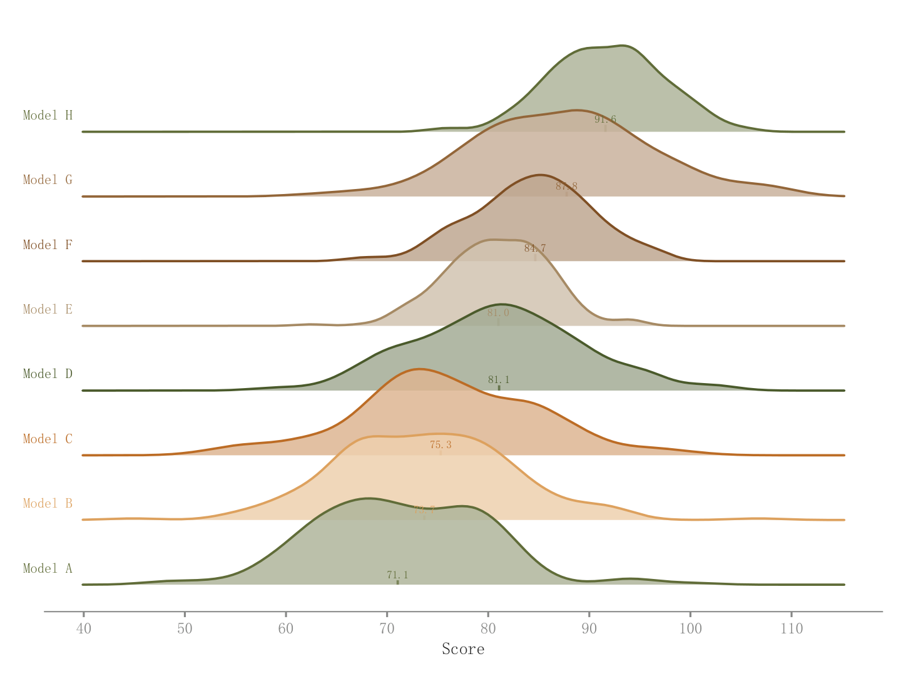

# 035 · 堆叠山脊密度

ID：`advanced.ridgeline`

用途：较多组的分布峰值、宽度与偏移如何？

标签：分布、比较

别名：ridgeline、joyplot、密度山脊

## 数据要求

- 分组原始连续样本

## 组合结构

多条密度曲线逐行上移并部分重叠

## 视觉特点

- 浅填充深轮廓
- 中位数虚线
- 末端组名

## 适配注意

当前代码为单层均匀填充，注释Gradient fill并未实现内部渐变；密度高度归一化不表达样本量。

## 预览

## 来源与核对

原名称：Ridgeline Plot — 山脊图（堆叠分布对比 + 渐变填充 + 中位数线）
原始代码：[查看](../sources/advanced.ridgeline/original.html)
预览范围：首个主要Python示例
已查看对应预览并核对主要绘图和数据代码；卡片不是统计有效性认证。

## 相近候选

- [竖向雨云分布组合](basic.raincloud.md)
- [完整小提琴与箱线显著性比较](basic.raincloud_violin.md)
- [类别内多方法小提琴](advanced.grouped_violin.md)
- [横向长尾分布雨云与分位标记](empirical.raincloud.md)
- [雨云分布与效应量显著性](academic.confusion_matrix.md)
- [模型误差横向雨云](empirical.prediction_error_raincloud.md)

<!-- fidelity:start -->
## 源码保真要点

以当前完整配方源码为底稿；下列行号指向解释预览的快照。数据适配不应顺手删掉这些视觉结构。

### 浅填充和错落山脊

- 保留重点：保留 _lighten(color,0.5) 的单层浅填充、alpha=0.85、独立深轮廓和由后到前的遮叠顺序；原代码没有连续渐变。
- 可适配：组数、密度带宽、间距和重叠程度可调；重新计算中位数，线段高度与当前密度归一化一致。
- 源码：[L36–37](../sources/advanced.ridgeline/original.html#L36) · [L38–39](../sources/advanced.ridgeline/original.html#L38) · [L44–46](../sources/advanced.ridgeline/original.html#L44)

按现有审图流程对照实际输出；有疑问时可用[源码差异提示](../../template-fidelity.md)。
