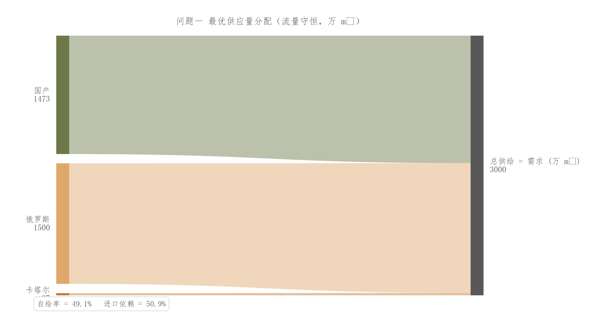
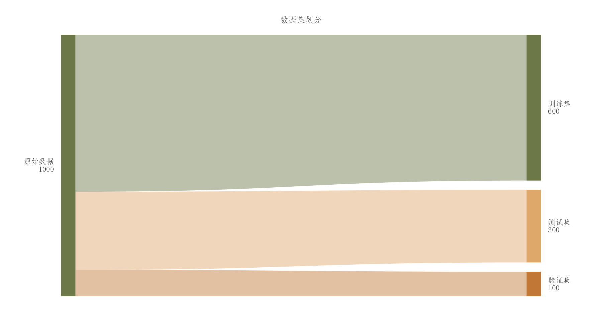
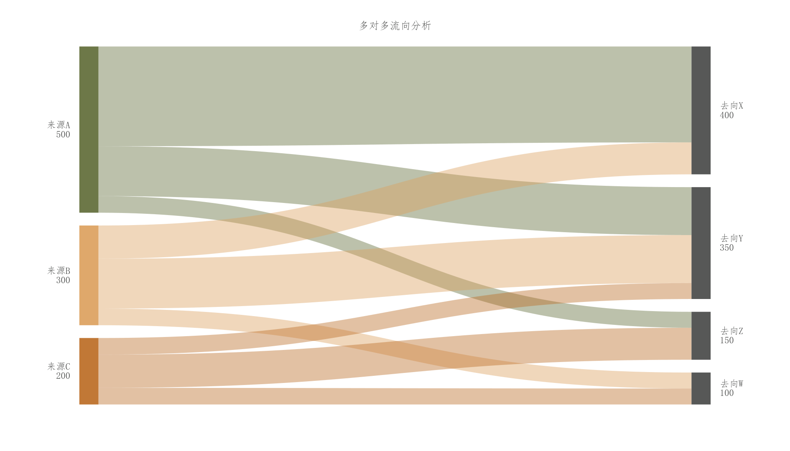

# 017 · 流量分配桑基图

ID：`advanced.sankey`

用途：资源或样本如何从来源分配到去向？

标签：流向、组成、组合

别名：sankey、流向图、资源分配

## 数据要求

- 来源节点、目标节点及非负流量
- 节点名称

## 组合结构

左右两列矩形节点；贝塞尔流带；包含多对一、一对多、多对多三个示例

## 视觉特点

- 半透明宽带
- 交叉叠色
- 节点总量标签
- 流量映射带宽

## 适配注意

三个预览均来自同一完整代码块；需要核对各节点流量守恒；当前模板非任意多阶段网络布局器。

## 预览

## 来源与核对

原名称：Sankey Diagram — 桑基图（D3 风格，矩形节点 + 贝塞尔流带）
原始代码：[查看](../sources/advanced.sankey/original.html)
预览范围：主要代码块的三个示例
已查看对应预览并核对主要绘图和数据代码；卡片不是统计有效性认证。

<!-- fidelity:start -->
## 源码保真要点

以当前完整配方源码为底稿；下列行号指向解释预览的快照。数据适配不应顺手删掉这些视觉结构。

### 流带宽度与交叉叠色

- 保留重点：保留矩形节点与封闭贝塞尔宽带、alpha=0.42 的流带叠色及 alpha=0.92 的节点。宽带不能缩成普通连线。
- 可适配：流量、节点数、节点间距与控制点可变；分别核对两侧流量占比和守恒，不机械等宽。
- 源码：[L62–63](../sources/advanced.sankey/original.html#L62) · [L72–73](../sources/advanced.sankey/original.html#L72) · [L105–106](../sources/advanced.sankey/original.html#L105)

按现有审图流程对照实际输出；有疑问时可用[源码差异提示](../../template-fidelity.md)。
