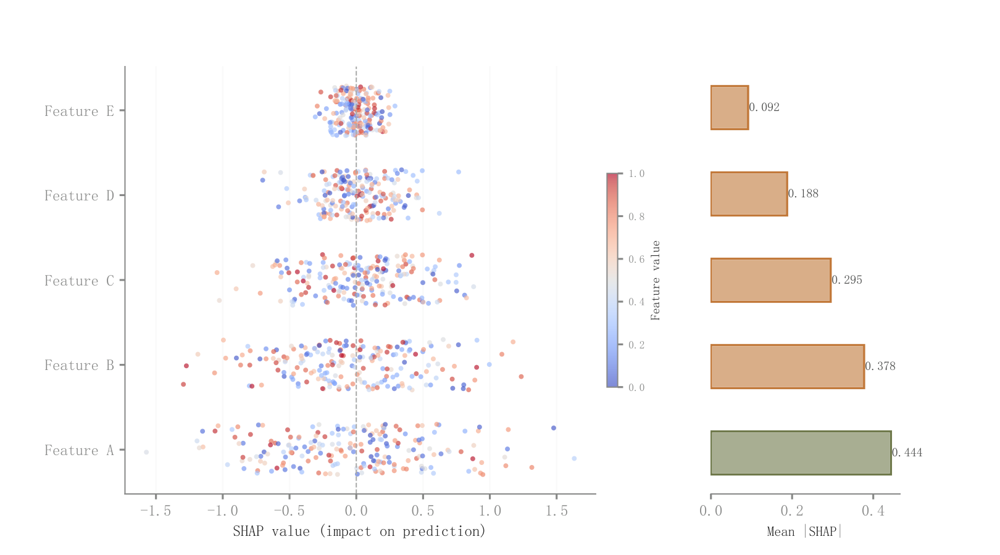

# 019 · SHAP散点蜂群与平均贡献条

ID：`advanced.shap_summary`

用途：特征怎样影响预测，哪个特征整体贡献更大？

标签：解释、分布、排序、组合

别名：SHAP、beeswarm、特征贡献方向

## 数据要求

- 样本×特征SHAP值
- 对应特征值

## 组合结构

左侧抖动SHAP散点；右侧平均绝对贡献条

## 视觉特点

- 特征值红蓝映射
- 共享特征行
- 条形高亮

## 适配注意

示例SHAP值是随机模拟，未计算模型解释；颜色与贡献正负是不同含义；需提供真实解释结果。

## 预览

## 来源与核对

原名称：SHAP Summary Plot — SHAP 特征重要性图
原始代码：[查看](../sources/advanced.shap_summary/original.html)
预览范围：首个主要Python示例
已查看对应预览并核对主要绘图和数据代码；卡片不是统计有效性认证。

<!-- fidelity:start -->
## 源码保真要点

以当前完整配方源码为底稿；下列行号指向解释预览的快照。数据适配不应顺手删掉这些视觉结构。

### 共享特征行的散点与汇总条

- 保留重点：保留左侧透明抖动散点、特征值连续着色与右侧浅填充深描边的平均绝对贡献条，两侧同一特征顺序。
- 可适配：真实 SHAP、特征值、特征数量和排序可变；色条仍表示特征值，不混成类别颜色。
- 源码：[L24–25](../sources/advanced.shap_summary/original.html#L24) · [L36–36](../sources/advanced.shap_summary/original.html#L36) · [L45–46](../sources/advanced.shap_summary/original.html#L45)

按现有审图流程对照实际输出；有疑问时可用[源码差异提示](../../template-fidelity.md)。
