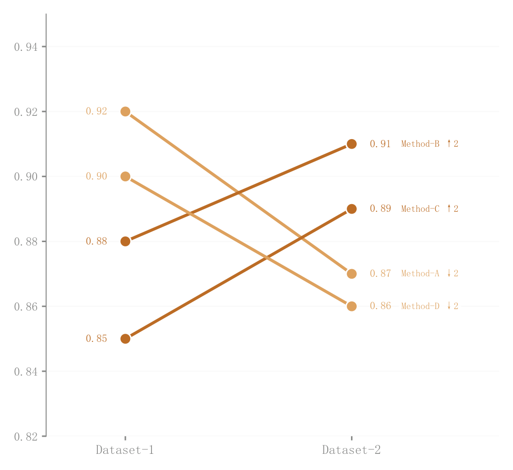

# 015 · 两阶段斜率与排名变化

ID：`advanced.slope`

用途：两个阶段的方法得分与名次怎样变化？

标签：变化、排序

别名：两阶段斜率与排名变化

## 数据要求

- 类别在两个阶段的数值

## 组合结构

左右两端连线；端点名称与名次

## 视觉特点

- 颜色区分类别
- 斜率表达增减
- 两侧数值标注

## 适配注意

只覆盖两个阶段；类别多时交叉拥挤；不能把得分斜率当成连续时间轨迹。

## 预览

## 来源与核对

原名称：Slope Chart — 斜率图（颜色编码线 + 排名变化标注）
原始代码：[查看](../sources/advanced.slope/original.html)
预览范围：首个主要Python示例
已查看对应预览并核对主要绘图和数据代码；卡片不是统计有效性认证。

## 相近候选

- [个体配对变化与均值箭头](advanced.paired_dot.md)
- [前后对比哑铃图](advanced.dumbbell.md)
- [多阶段名次轨迹](advanced.bump.md)

<!-- fidelity:start -->
## 源码保真要点

以当前完整配方源码为底稿；下列行号指向解释预览的快照。数据适配不应顺手删掉这些视觉结构。

### 端点配对与两侧读数

- 保留重点：保留逐对象两端连接、白边端点、左右数值与对象身份，不把配对关系改成均值趋势。
- 可适配：左右两次测量与名次重新计算，标签可避让，保持同一可比尺度。
- 源码：[L26–27](../sources/advanced.slope/original.html#L26) · [L30–31](../sources/advanced.slope/original.html#L30) · [L32–33](../sources/advanced.slope/original.html#L32) · [L36–37](../sources/advanced.slope/original.html#L36) · [L38–39](../sources/advanced.slope/original.html#L38) · [L46–48](../sources/advanced.slope/original.html#L46) · [L50–51](../sources/advanced.slope/original.html#L50)

按现有审图流程对照实际输出；有疑问时可用[源码差异提示](../../template-fidelity.md)。
