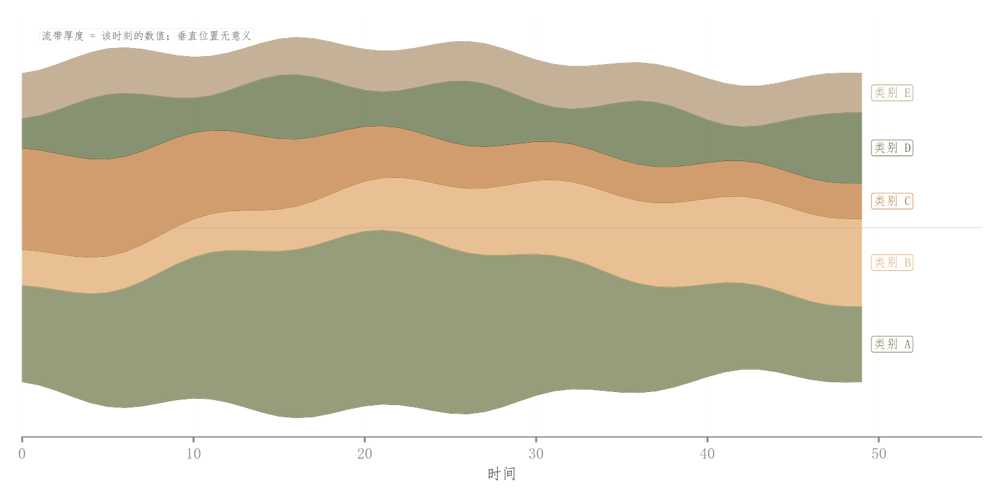

# 045 · 居中流带图

ID：`advanced.streamgraph`

用途：多个类别随时间如何兴衰与交替？

标签：组成、趋势

别名：居中流带图

## 数据要求

- 时间×类别非负值

## 组合结构

总量居中偏移的堆叠面积；末端标签

## 视觉特点

- 流带起伏
- 浅填充与细轮廓
- 省略纵轴刻度

## 适配注意

厚度编码值，垂直位置无实际含义；示例有平滑，正式数据平滑需保留解释。

## 预览

## 来源与核对

原名称：Streamgraph — 流图（居中堆叠基线 + 多类别 + 末端标签）
原始代码：[查看](../sources/advanced.streamgraph/original.html)
预览范围：首个主要Python示例
已查看对应预览并核对主要绘图和数据代码；卡片不是统计有效性认证。

## 相近候选

- [堆叠面积与事件标记](basic.area.md)
- [方差分解总览与次要成分放大](empirical.variance_decomposition.md)

<!-- fidelity:start -->
## 源码保真要点

以当前完整配方源码为底稿；下列行号指向解释预览的快照。数据适配不应顺手删掉这些视觉结构。

### 居中流带与连续轮廓

- 保留重点：保留总量居中偏移的流带、浅填充与细轮廓以及末端类别标签，不改成零基线普通面积图。
- 可适配：成分数量与序列长度可变；成分可相加，末端很窄时调整标签位置而非删掉流带。
- 源码：[L32–34](../sources/advanced.streamgraph/original.html#L32) · [L37–40](../sources/advanced.streamgraph/original.html#L37) · [L54–58](../sources/advanced.streamgraph/original.html#L54)

按现有审图流程对照实际输出；有疑问时可用[源码差异提示](../../template-fidelity.md)。
