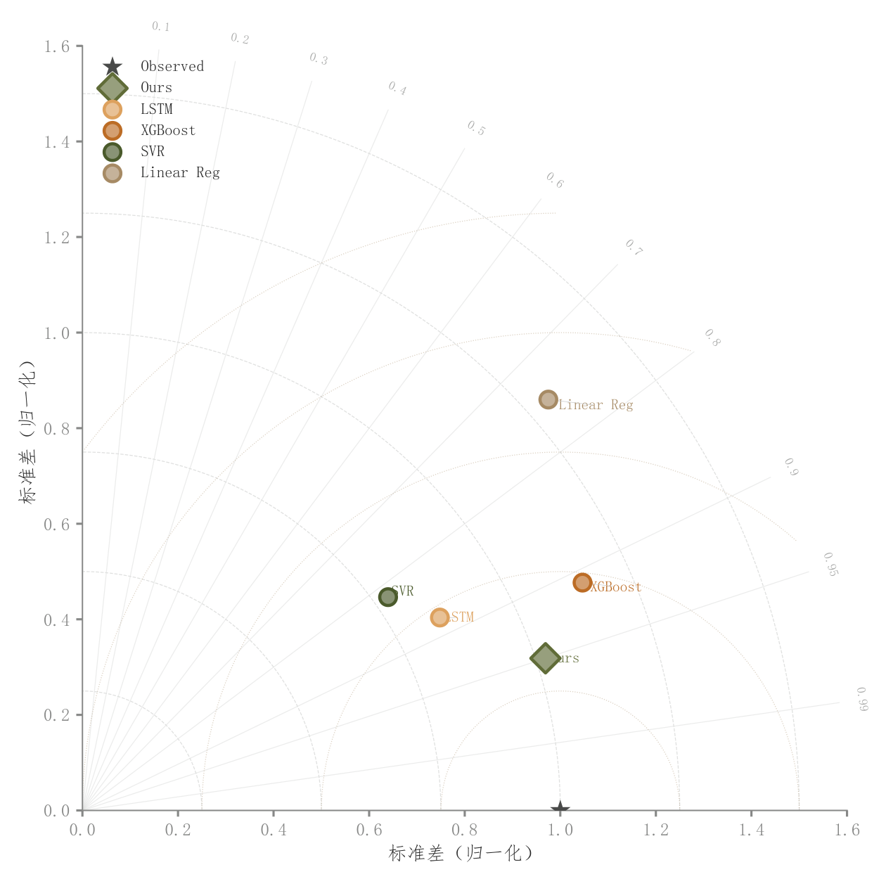

# 031 · Taylor模型综合比较

ID：`advanced.taylor`

用途：模型相关、标准差与中心化误差怎样权衡？

标签：预测、比较、多维

别名：Taylor模型综合比较

## 数据要求

- 参考标准差
- 各模型相关系数与归一化标准差

## 组合结构

四分之一极坐标式统计图

## 视觉特点

- 相关射线
- 标准差弧
- RMSE参考弧
- 模型点标签

## 适配注意

当前角域主要覆盖非负相关；这里RMSE弧对应中心化差异，不等同含偏差总RMSE。

## 预览

## 来源与核对

原名称：Taylor Diagram — Taylor 图（多模型对比：相关系数 + 标准差 + RMSE）
原始代码：[查看](../sources/advanced.taylor/original.html)
预览范围：首个主要Python示例
已查看对应预览并核对主要绘图和数据代码；卡片不是统计有效性认证。

<!-- fidelity:start -->
## 源码保真要点

以当前完整配方源码为底稿；下列行号指向解释预览的快照。数据适配不应顺手删掉这些视觉结构。

### 统计参考弧和模型点

- 保留重点：保留相关射线、标准差弧、RMSE 参考弧及观测参考星号，点在同一统计坐标体系内。
- 可适配：模型数和尺度可变，按实际相关与标准差定位；负相关超出示例象限时扩展坐标结构。
- 源码：[L29–29](../sources/advanced.taylor/original.html#L29) · [L37–38](../sources/advanced.taylor/original.html#L37) · [L48–49](../sources/advanced.taylor/original.html#L48) · [L52–52](../sources/advanced.taylor/original.html#L52) · [L64–65](../sources/advanced.taylor/original.html#L64)

按现有审图流程对照实际输出；有疑问时可用[源码差异提示](../../template-fidelity.md)。
