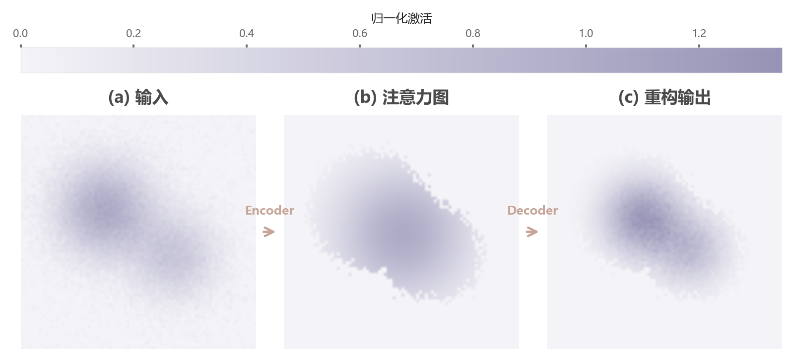

# 043 · 输入—中间响应—输出三联图

ID：`advanced.triptych`

用途：处理过程前后发生了什么，中间关注哪里？

标签：组合、图像、解释

别名：输入—中间响应—输出三联图

## 数据要求

- 三张空间可对齐的二维标量图
- 共同数值范围

## 组合结构

横向三面板；顶部共享色条；面板间箭头

## 视觉特点

- 相同连续色阶
- 空间结构对照
- 流程指向

## 适配注意

实际使用viridis，非分类色板；不同量纲图不能强行共享色条；预览顶部刻度与标题邻近。

## 预览

## 来源与核对

原名称：Triptych — 三联图（input / 中间表示 / output 横向对比 + 流向箭头）
原始代码：[查看](../sources/advanced.triptych/original.html)
预览范围：首个主要Python示例
已查看对应预览并核对主要绘图和数据代码；卡片不是统计有效性认证。

<!-- fidelity:start -->
## 源码保真要点

以当前完整配方源码为底稿；下列行号指向解释预览的快照。数据适配不应顺手删掉这些视觉结构。

### 三面板共用数值尺度

- 保留重点：保留横向三联图、共享色条与相同归一化范围，面板间箭头表达实际处理次序。
- 可适配：网格大小和布局间距可变；比较同量纲量时不可每面板独立拉伸色阶制造差异。
- 源码：[L30–31](../sources/advanced.triptych/original.html#L30) · [L39–39](../sources/advanced.triptych/original.html#L39)

按现有审图流程对照实际输出；有疑问时可用[源码差异提示](../../template-fidelity.md)。

## 项目配色

热图默认读取项目配色；连续插值、中性色、透明度及数据归一化保留，数值文字按实际底色选择对比色。
