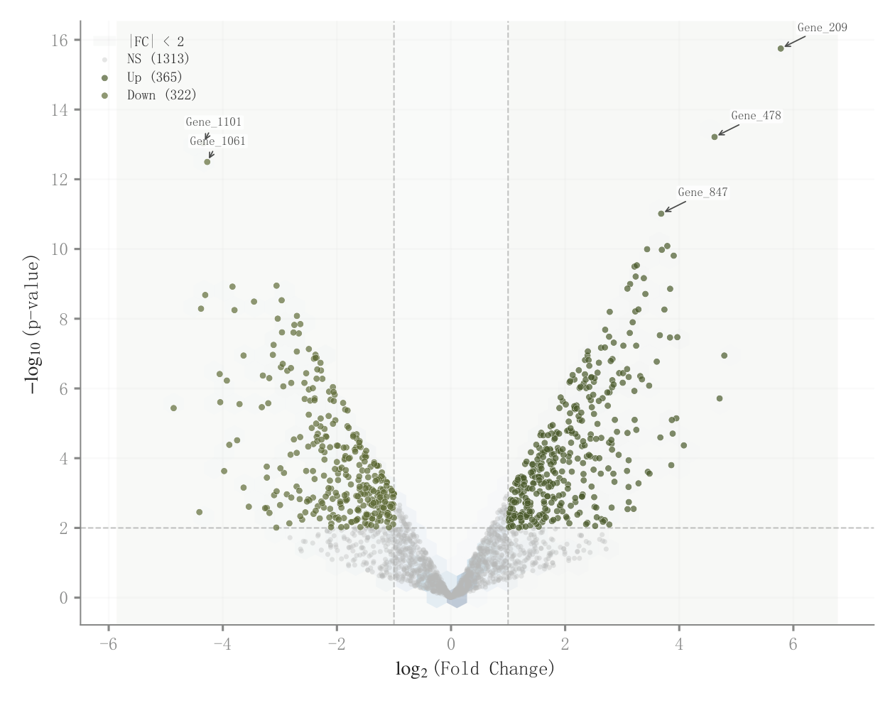

# 022 · 差异倍数与显著性火山图

ID：`advanced.volcano`

用途：哪些特征变化幅度大且统计显著？

标签：筛选、关联

别名：差异倍数与显著性火山图

## 数据要求

- 特征名
- log2倍数变化
- p值或校正p值

## 组合结构

单面板散点；横纵阈值线

## 视觉特点

- 中央阈值阴影
- 背景密度
- 重点特征引线

## 适配注意

红蓝或上下调标签需对照实际语义；示例显著性是模拟，不能用于实证结论。

## 预览

## 来源与核对

原名称：Volcano Plot — 火山图（基因差异表达：渐变密度背景 + 基因标签 + 倍数变化阴影）
原始代码：[查看](../sources/advanced.volcano/original.html)
预览范围：首个主要Python示例
已查看对应预览并核对主要绘图和数据代码；卡片不是统计有效性认证。

<!-- fidelity:start -->
## 源码保真要点

以当前完整配方源码为底稿；下列行号指向解释预览的快照。数据适配不应顺手删掉这些视觉结构。

### 阈值区与重点点云

- 保留重点：保留灰色背景点、两侧重点点的透明度差异、阈值参考与重点引线，不能让背景点遮没显著点。
- 可适配：倍数变化、检验结果、阈值和标签数量据实调整，显著性不能由视觉挑选。
- 源码：[L25–25](../sources/advanced.volcano/original.html#L25) · [L26–26](../sources/advanced.volcano/original.html#L26) · [L27–27](../sources/advanced.volcano/original.html#L27) · [L34–35](../sources/advanced.volcano/original.html#L34) · [L36–37](../sources/advanced.volcano/original.html#L36) · [L38–39](../sources/advanced.volcano/original.html#L38) · [L42–42](../sources/advanced.volcano/original.html#L42) · [L43–43](../sources/advanced.volcano/original.html#L43) · [L44–44](../sources/advanced.volcano/original.html#L44) · [L51–59](../sources/advanced.volcano/original.html#L51)

按现有审图流程对照实际输出；有疑问时可用[源码差异提示](../../template-fidelity.md)。
